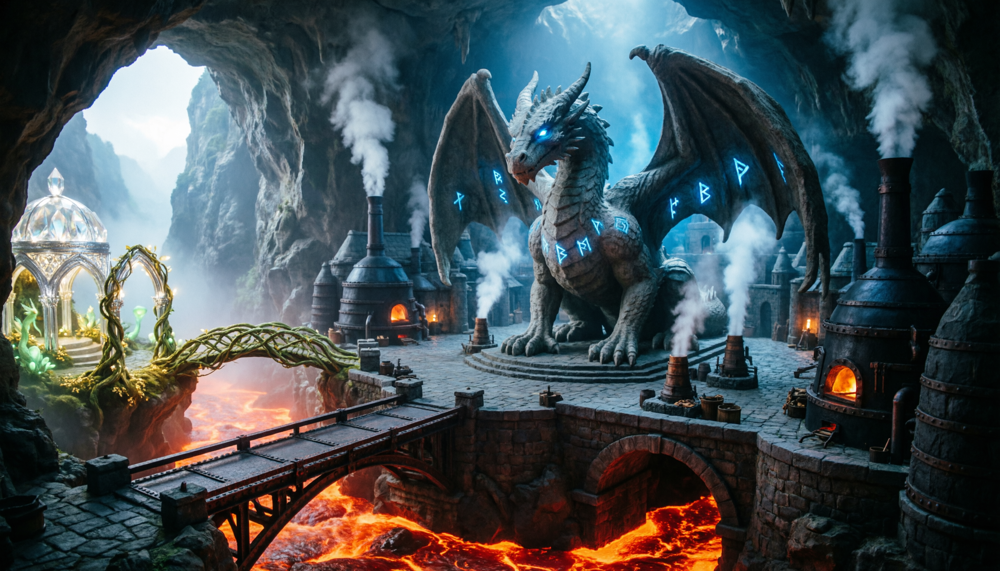
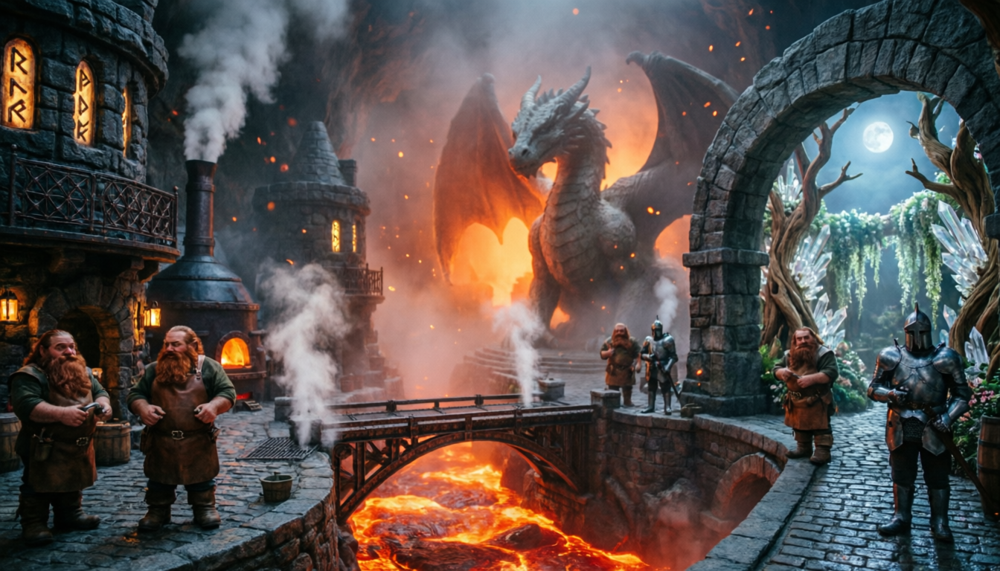
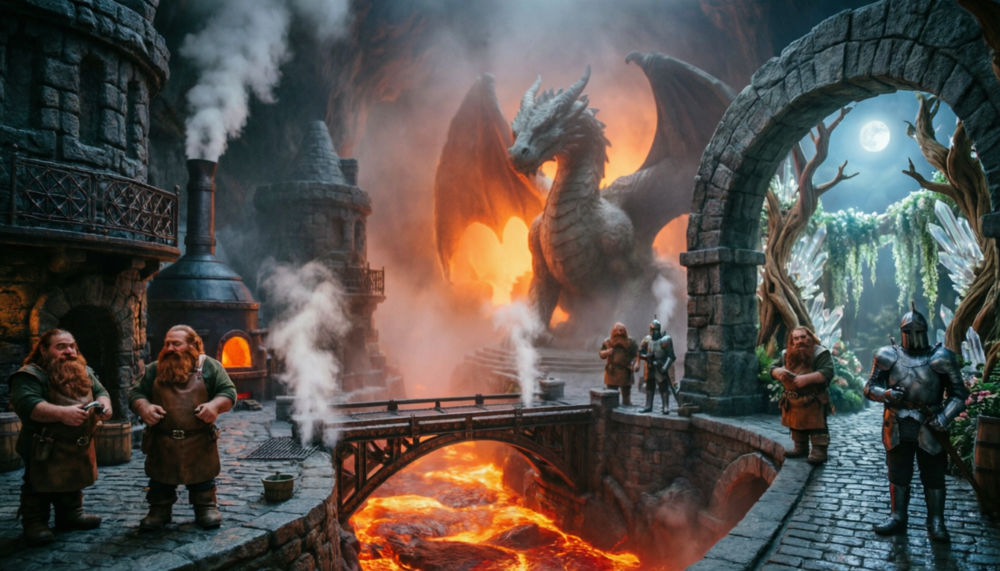
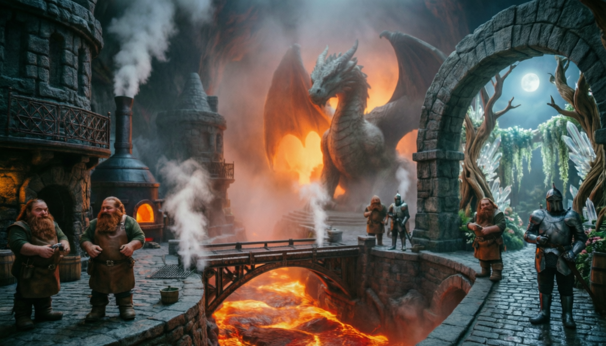

# Промпты: Камнеград

## 1. Общий план пещеры

> Epic wide-angle view of a massive dwarven city carved inside a colossal mountain cavern. In the center, a monumental stone dragon statue with outstretched wings overlooks the main plaza, its eyes glowing with faint blue magic. Massive forged iron bridges and stone arches span across rivers of flowing lava and deep chasms. Architecture is grim, monolithic, built from dark basalt and black iron, with smoke rising from forge chimneys and steam venting from geothermal shafts. To the left, a contrasting elven enclave: graceful silver arches, living vine bridges, crystal domes, and soft golden-green bioluminescent light. Cinematic volumetric lighting, warm orange lava glow contrasting with cool blue rune-light and elven magic. Highly detailed fantasy concept art, epic scale, style of Craig Mullins and Feng Zhu, dramatic shadows, atmospheric fog --ar 16:9 --v 6.0 --style raw

## 2. Улица к лавовому мосту

> Street-level view inside a dwarven mountain city. Heavy cobblestone streets, polished smooth by centuries of boots, lead toward a massive wrought-iron bridge spanning a river of bubbling lava. Buildings are carved from dark stone with runic glowing windows, iron-grated balconies, and smoke curling from forge vents. Dwarven merchants in leather aprons, armored guards patrolling, steam rising from grates. In the distance, through haze and ember-light, the colossal dragon statue looms, backlit by lava glow. To the right, a stone archway marks the transition to the elven quarter: stonework gives way to living wood, crystal lattices, and soft moonlight filtering through hanging gardens. Moody atmospheric fantasy, floating embers, detailed textures of stone and metal, cinematic composition --ar 16:9 --v 6.0 --style raw

## 3. Площадь и статуя дракона

> Hero shot of the central plaza in a dwarven underground city. A colossal ancient stone dragon statue dominates the frame, wings partially spread, eyes and scales faintly glowing with arcane blue energy. Around it: massive basalt columns, forged lanterns, market stalls with leather awnings, and armored dwarven guards. In the background, across a lava chasm, an elegant bridge leads to the elven enclave with silver arches and hanging gardens. Dramatic high-contrast lighting: warm orange lava glow from below, cool blue rune-light from above, deep volumetric shadows. Epic fantasy concept art, high detail, AAA game cinematic style, style of Jama Jurabaev and WLOP --ar 16:9 --v 6.0 --style raw

## 4. Эльфийский анклав

> The elven diplomatic enclave inside a dwarven mountain city. A serene contrast: graceful silver-wood arches and crystal bridges span a small crystalline waterfall that feeds into a lava river below. Bioluminescent vines with glowing flowers, floating stone platforms with light pavilions, soft golden-teal ambient light. In the background, the grim dwarven walls, heavy iron gates, and forge-smoke emphasize the cultural contrast. Atmospheric fantasy illustration, detailed architecture, cinematic lighting, style of Alena Aenami and WLOP, ethereal mood --ar 16:9 --v 6.0 --style raw

