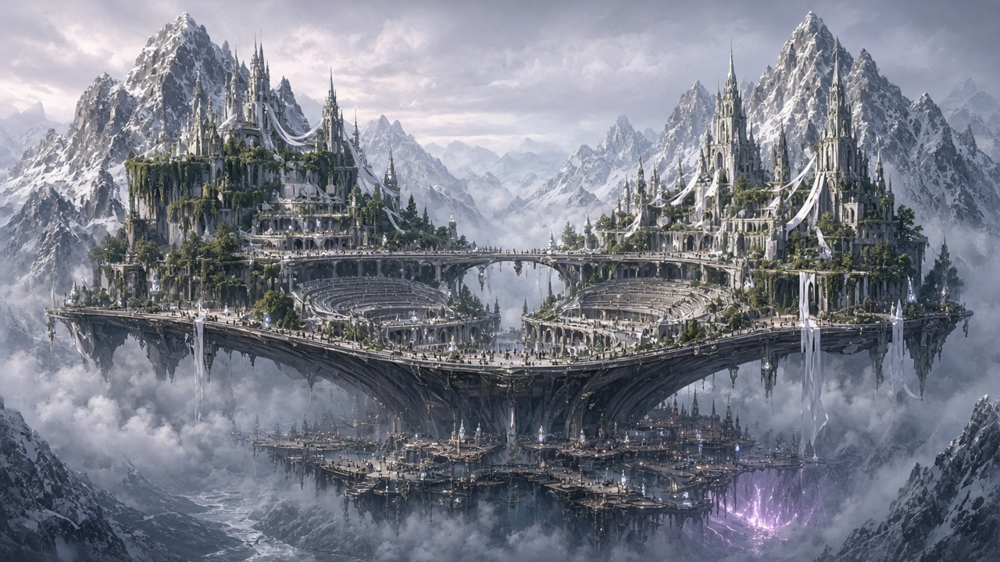
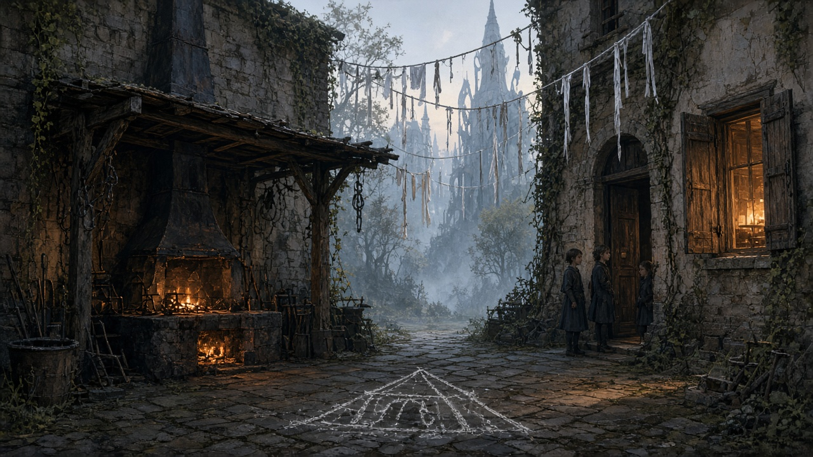
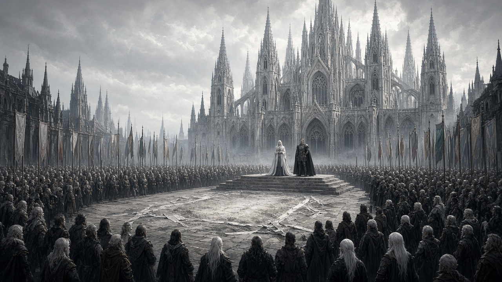
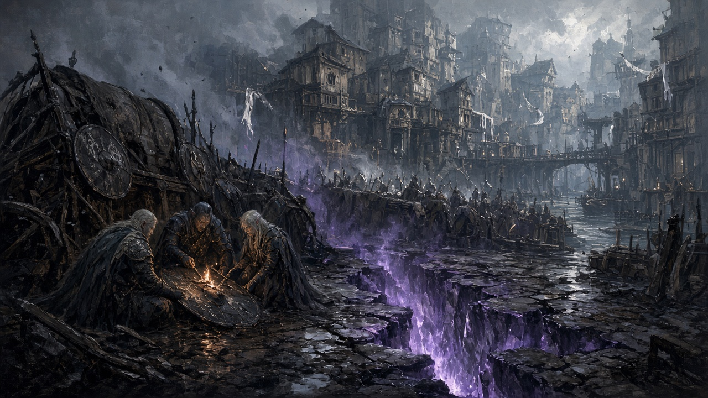

# Промпты: Лунный Мост — сессия 1 («Город без голоса»)

Единый стиль с Камнеградом: cinematic fantasy concept art, 16:9, volumetric light, без текста на картинке, без портретов героев крупным планом.

Канон кадра: парящий мост между двумя снежными пиками над долиной (Чаша Шепотов); три яруса города; сейчас — **поминки**, не фестиваль (белые ленты, пепел, колокола, пустой плацдарм шатра).

## 1. Общий план города в день похорон

> Epic wide-angle view of Moon Bridge, a sacred elven city spanning as a floating stone-and-silver bridge between two colossal snow-capped mountain peaks above a misty valley bowl. Three vertical tiers of architecture: upper monasteries and hanging gardens, middle amphitheaters and silverwood markets, lower docks and crowded streets. White mourning ribbons on towers and railings; festival banners gone. Soft overcast dawn light mixed with cool moonlight glow from crystal lanterns. A faint violet shimmer marks a distant rift wound near the lower city. Cinematic volumetric fog, epic scale, highly detailed fantasy concept art, style of Craig Mullins and Feng Zhu, atmospheric --ar 16:9 --style raw

## 2. Утро во дворе Кузницы Фиалки (Колыбель Рассвета)

> Courtyard of a modest orphanage-forge in the foreign quarter of an elven city at dawn. Stone courtyard with a cold forge hearth under a simple awning, anvil wrapped with white mourning threads, chalk drawing of a tent scratched out on the paving. A few quiet children by the doorway; laundry lines with white ribbons. Warm kitchen light from open shutters contrasts with cool morning mist. Smell of cold coal and cheap incense suggested by atmosphere. Intimate, melancholic fantasy illustration, detailed textures of stone and iron, cinematic soft light, style of Alena Aenami and WLOP --ar 16:9 --style raw

## 3. Центральный помост — Площадь Нисходящего Луча

> Grand ceremonial plaza before a towering pale cathedral of silent bells in an elven sacred city. Where a festival pavilion once stood, an empty ash rectangle marked by white ribbons and grey dust. A raised stone platform holds a silent priestess in pale vestments and a stern wartime mayor in dark armor addressing a vast crowd of mixed races. Distant foreign delegation flags along the edges. Overcast silver light from above, cathedral spires catching cold glow. Solemn funeral atmosphere, no carnival color. Epic fantasy concept art, high detail, AAA cinematic, style of Jama Jurabaev and WLOP --ar 16:9 --style raw

## 4. Низ у края Разлома — баррикады Тар-Аминона

> Street-level view of the lower tier of Moon Bridge city beside a wounded street-rift. Barricades of wagons and shields blackened with soot; soldiers burning names on a shield; wet ash and violet heat-shimmer rising from a cracked glowing purple tear in the cobblestones. Crowded tenements and docks in background; white ribbons scarce — only coal smoke and fear. Moody atmospheric fantasy, floating ash, dramatic contrast of cold stone and unnatural violet rift-light, cinematic composition, style of Craig Mullins --ar 16:9 --style raw

