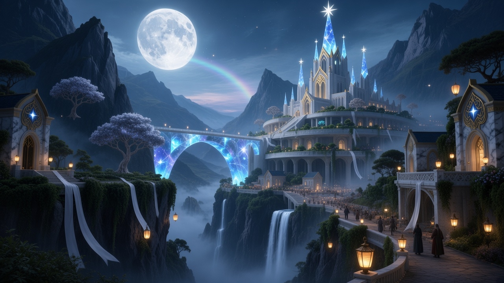
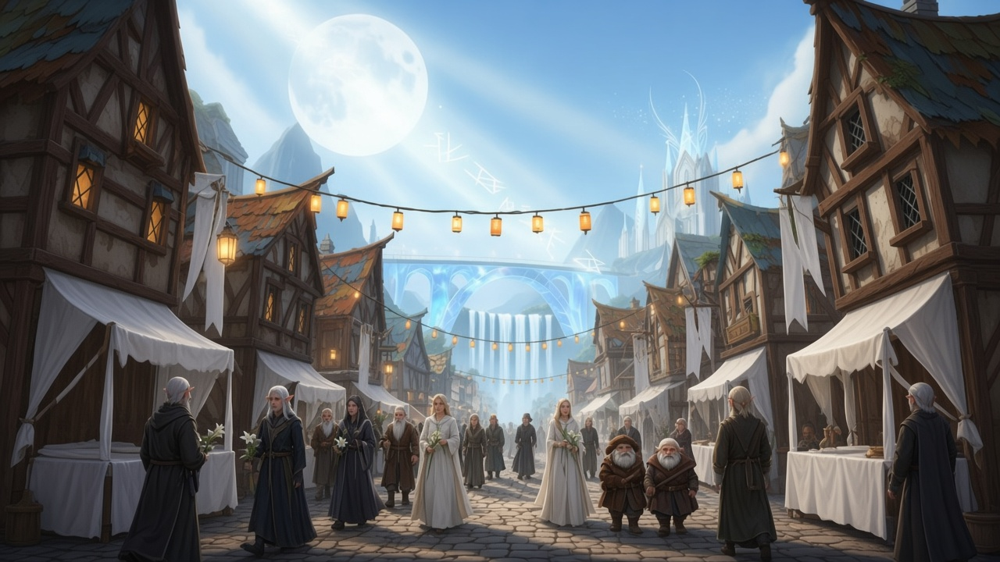
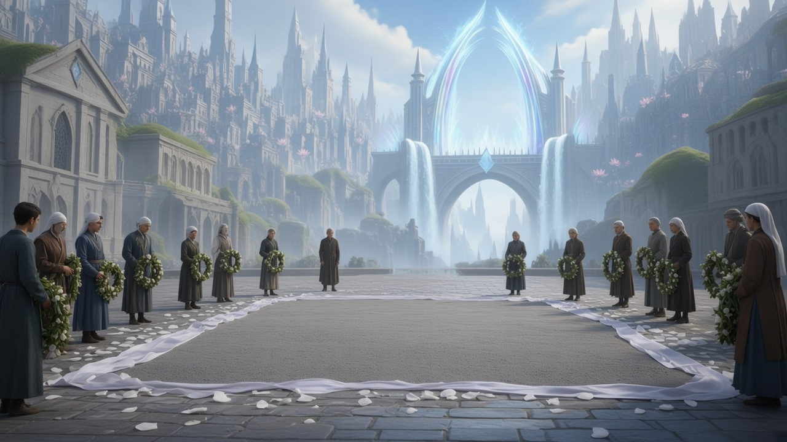
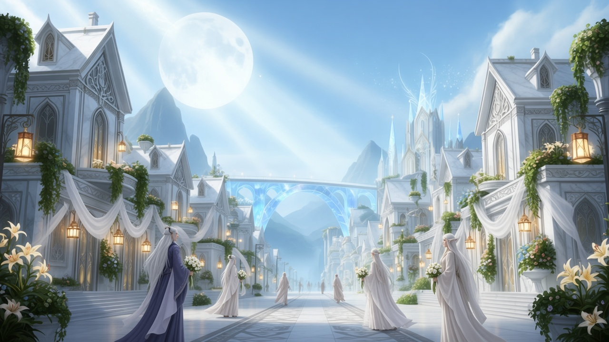
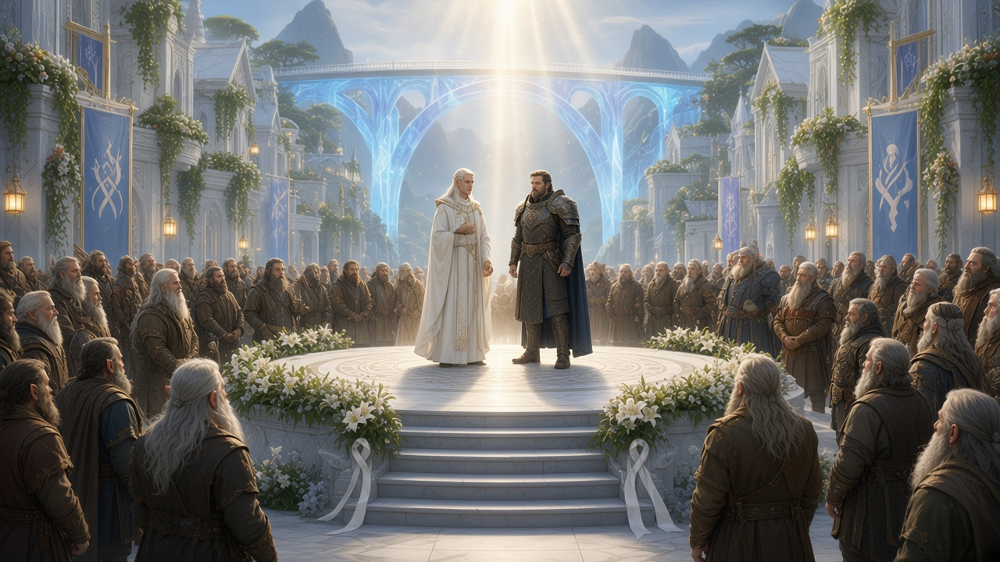
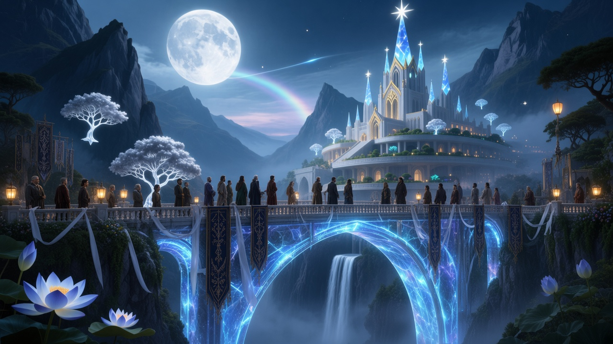

# Промпты: похороны Маэстро — кинематографичная серия

**Визуальный канон локации** (сессия 1 кампании, «до фестиваля»):  
[`../images/lunnyy-most-festival-ref/`](../images/lunnyy-most-festival-ref/)

Ключевые якоря стиля (сохранять во всех кадрах похорон):
- светящаяся **Лунная арка / мост** (полупрозрачный синий кристалл-свет, водопады);
- белый эльфийский камень + в Нижнем/Районе Пришельцев — фахверк;
- огромная луна, лунные лучи, небесные руны;
- лотосы / фонари / белые ленты — но **поминки**: розовый фестиваль снят, вместо него белые ленты, пепел, тишина.

**Запрет:** Кардиан в кадре; мрачный «grimdark» без эльфийского света; текст/вывески на английском.

---

## Кадр A — Establishing: город в день похорон

Реф: `09-cliff-palace-night.jpg` + `07-street-to-bridge.jpg`

> Same sacred elven city as the Moon Bridge festival references: white marble cliffside palace with glowing blue star-tips, luminous translucent blue crystal energy bridge spanning a misty gorge with waterfalls, giant full moon. Now it is the day of Maestro Celebrim's funeral. Festival pink lotuses and carnival banners are gone. White mourning ribbons hang from balconies and lantern lines. Market lanterns burn low and sparse. Few silent figures on the terrace. The blue bridge still glows but softer, cooler silver-blue. Cinematic wide establishing shot, ethereal high fantasy, same architecture and lighting language as the reference, solemn not grimdark --ar 16:9

## Кадр B — Район Пришельцев: улица к мосту

Реф: `02-outsiders-quarter-market.jpg`

> Same Outsiders Quarter street as the festival reference: half-timber houses, cobblestones, warm lantern strings, glowing blue Moon Bridge and waterfall and white crystal spires at the end of the street, huge moon with light beams. Festival market is closed: awnings rolled, fruit stalls empty or covered in white cloth, white mourning ribbons instead of colorful festival flags. A quiet funeral procession of elves, humans and dwarves in dark and pale robes walks toward the bridge carrying white lilies. Solemn cinematic street-level shot, same painterly fantasy style as reference --ar 16:9

## Кадр C — Плацдарм: место шатра Маэстро

Реф: `08-lotus-plaza-festival.jpg`

> Same grand plaza looking toward the Moon Bridge arch with waterfalls and white city spires as the pink-lotus festival reference. The festival maypole and pink lotus canopy are gone. In the center of the plaza: an empty ash rectangle outlined with white mourning ribbons where Maestro Celebrim's pavilion once stood; grey ash and white petals on the stones. Sparse crowd of mourners leaving wreaths. Soft overcast silver light mixed with the cool blue glow of the distant bridge. Cinematic emotional wide shot, ethereal elven fantasy, no text --ar 16:9

## Кадр D — Верхняя авеню под лунным лучом

Реф: `01-upper-avenue-moonbeam.jpg`

> Same pristine white-marble elven avenue with hanging vines, lily planters, glowing lanterns, translucent blue Moon Bridge mid-frame, crystal palace beyond, giant moon and celestial runes in the sky — matching the festival reference. Tone shifted to funeral: white ribbons on facades, elves in pale and deep mourning robes walking slowly toward the bridge, carrying white flowers; no celebratory chatter. Soft divine moonbeam still falls. Cinematic solemn beauty, same clean ethereal style --ar 16:9

## Кадр E — Центральный помост у Собора

Реф: `01-upper-avenue-moonbeam.jpg` + `10-open-pavilion-beam.jpg`

> Ceremonial funeral at the Square of the Descending Ray in Moon Bridge city. Pale cathedral / open sacred pavilion of white stone before the glowing blue Moon Bridge landmark. A raised platform: a silent priestess in white vestments and a wartime mayor in dark armor addressing a vast mixed crowd. White ribbons, wreaths, foreign delegation banners at the edges. A soft column of silver-gold light descends onto the platform. Ethereal high-fantasy cinematic, architecture consistent with Moon Bridge festival references, solemn not gothic grimdark, no readable text --ar 16:9

## Кадр F — Мост Предков, чужие флаги

Реф: `09-cliff-palace-night.jpg` + `07-street-to-bridge.jpg`

> On the luminous translucent blue Moon Bridge spanning the misty gorge between cliffs, night after the ceremony. Foreign funeral banners and white ribbons along the bridge rail. Delegations from distant lands stand in quiet groups. Waterfalls roar below. White marble palace with blue star-tips on the cliff. Giant full moon. Cinematic hero wide shot of political mourning, same ethereal Moon Bridge visual language as references --ar 16:9

