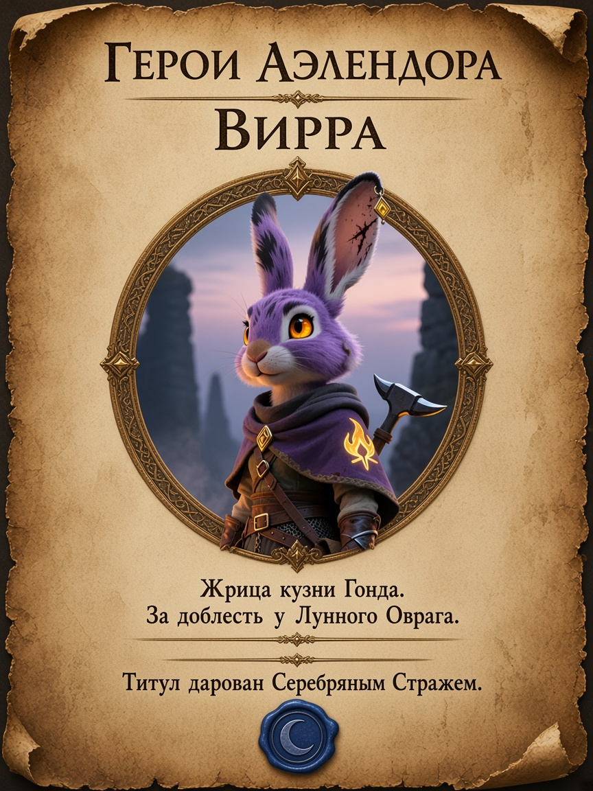

# Пергаментные объявления для игровой комнаты

Идея мастера: развесить по комнате объявления о героях и злодеях **как на пергаменте**.

## Визуальный канон серии

- Носитель: **состаренный пергамент** (рваные/подпалённые края, пятна, трещины, сепия).
- Текст на афише: **только русский** (кириллица).
- Портрет: гравюра / чернильный набросок / медальон.
- Печать: сургуч (Аэлендор / Серебряный Страж).
- Формат: **вертикаль 3:4**.
- **Кардиан:** лицо и костюм брать из арта снов (`assets/images/dreams/kardian-dream-*.jpg` на ветках арки 3) — человек, тёмные короткие волосы, щетина, тёмно-синий камзол с золотой вышивкой. **Не** эльф с серебряными волосами.

## Актуальные пробы

### 1. Розыск — Кардиан

Референсы лица: `kardian-dream-02-humanity-breaks.jpg`, `kardian-dream-02-three-graves.jpg`, `kardian-dream-03-ice-scrolls.jpg`, `kardian-dream-01-kelebrim-refuse.jpg`.

Текст на листе:

- РОЗЫСК
- КАРДИАН
- Некромант Мёртвого города.
- Награда — шесть артефактов Падения.
- Печать: ПЕЧАТЬ АЭЛЕНДОРА

> Vertical fantasy WANTED poster on aged parchment, photoreal paper texture, torn burnt edges, stains, cracks. All text clear readable RUSSIAN Cyrillic only. Top: РОЗЫСК. Name: КАРДИАН. Under portrait: Некромант Мёртвого города. Then: Награда — шесть артефактов Падения. Portrait must match dream-art references: human man late 30s–40s, short dark messy hair, light stubble, gaunt face with dark circles, dark navy coat with gold-bronze floral embroidery on lapels. Ink/sepia woodcut on parchment. NOT an elf, NOT silver hair. Red wax seal: ПЕЧАТЬ АЭЛЕНДОРА. No English.

### 2. Герои Аэлендора — Вирра

**Референс внешности:** [`../images/portraits/virra.png`](../images/portraits/virra.png) (из `virra.pdf`, стр. 2).  
Сиреневый мех, янтарные глаза, шрам-молния на ухе + золотой ромб, пламенная эмблема Гонда на накидке.

Текст на листе:

- ГЕРОИ АЭЛЕНДОРА
- ВИРРА
- Жрица кузни Гонда. За доблесть у Лунного Оврага.
- Титул дарован Серебряным Стражем.

> Vertical fantasy hero proclamation on warm aged parchment. All text RUSSIAN Cyrillic only. Header: ГЕРОИ АЭЛЕНДОРА. Name: ВИРРА. Below: Жрица кузни Гонда. За доблесть у Лунного Оврага. Footer: Титул дарован Серебряным Стражем. Portrait MUST match character-sheet reference: female harengon with vivid saturated LIGHT PURPLE / LAVENDER / VIOLET fur (not brown, not grey, not sepia-washed), deep rich purple capelet, glowing amber-orange eyes, dark lightning scar on left ear with golden diamond pendant, yellow-orange geometric flame emblem of Gond, leather straps and gauntlets. Paper may be aged tan, but character colors stay vivid purple. Circular medallion, blue wax seal with crescent. No English.

## Кандидаты на серию

**Герои:** Вирра (проба), Грок, Балтан, Дранник, Кавил, Плач звезды, Эларион, общая афиша «Бродяга».  
**Злодеи:** Кардиан (проба), Пиппин, Багал, Хвост Скорпиона, Культ Лолс, Константин III.
