# Пергаментные объявления для игровой комнаты

Идея мастера: развесить по комнате объявления о героях и злодеях **как на пергаменте**.

**Готовые арты:** [`../images/parchment-posters/`](../images/parchment-posters/)  
**Портреты из чарников:** [`../images/portraits/`](../images/portraits/)

## Визуальный канон серии

- Носитель: **состаренный пергамент** (рваные/подпалённые края, пятна, трещины).
- Текст: **только русский**.
- Вёрстка текста (единый шаблон героев; **эталон шрифтов — Вирра**):
  1. Сверху: `ГЕРОИ АЭЛЕНДОРА` — классический **serif ALL CAPS**
  2. Имя героя — **каллиграфия / script, Title Case** (как «Вирра», не CAPS-блок)
  3. Портрет (без текста поверх)
  4. Снизу три строки чистым **serif** (sentence case): класс/роль · «За доблесть у Лунного Оврага.» · «Титул дарован Серебряным Стражем.»
  5. Синий сургуч с полумесяцем
- Розыск: serif-заголовок `РОЗЫСК` (+ при необходимости `ОСОБО ОПАСЕН`) → каллиграфия имени → serif внизу; красный сургуч. **Не** писать «ГЕРОИ АЭЛЕНДОРА».
- Рекомендация (Невил и подобные): заголовок `РЕКОМЕНДАЦИЯ` → каллиграфия имени → положительный serif-текст; гражданский сургуч (не синий полумесяц героев). **Не** герой Аэлендора.
- Герои партии: внешность **строго** из [`../images/portraits/`](../images/portraits/).
- Кардиан: лицо из артов снов.

## Афиши

### 0. Розыск — Кардиан

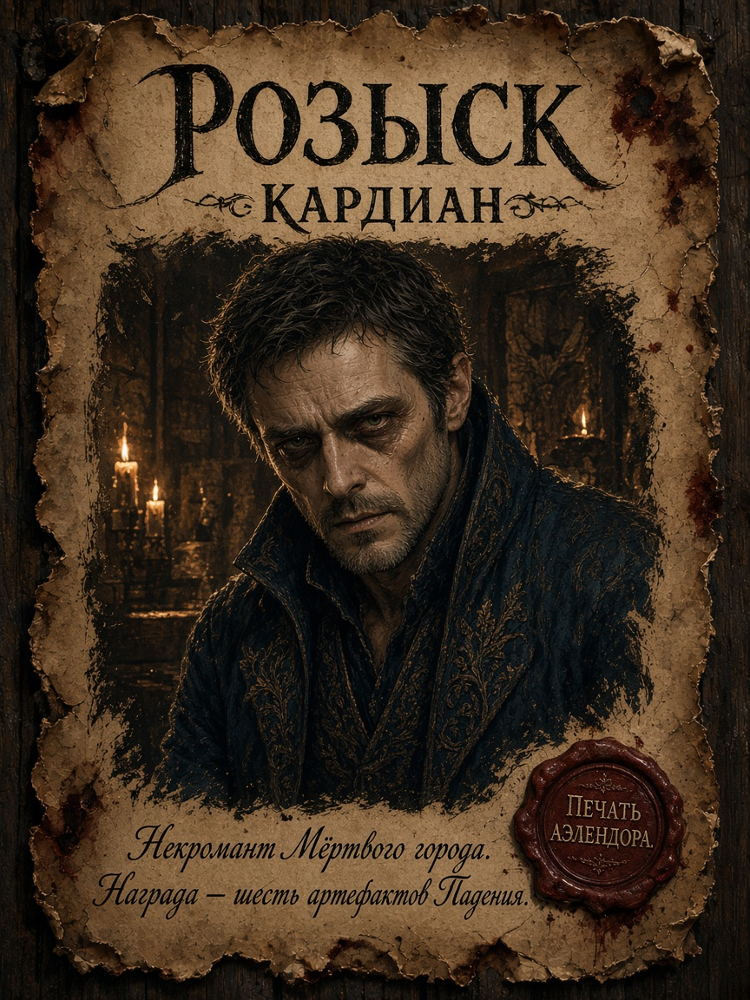

### 1. Герои — Грок

Референс: [`../images/portraits/grok.png`](../images/portraits/grok.png)

Текст:

- ГЕРОИ АЭЛЕНДОРА / Грок
- Паладин Смотрителей.
- За доблесть у Лунного Оврага.
- Титул дарован Серебряным Стражем.

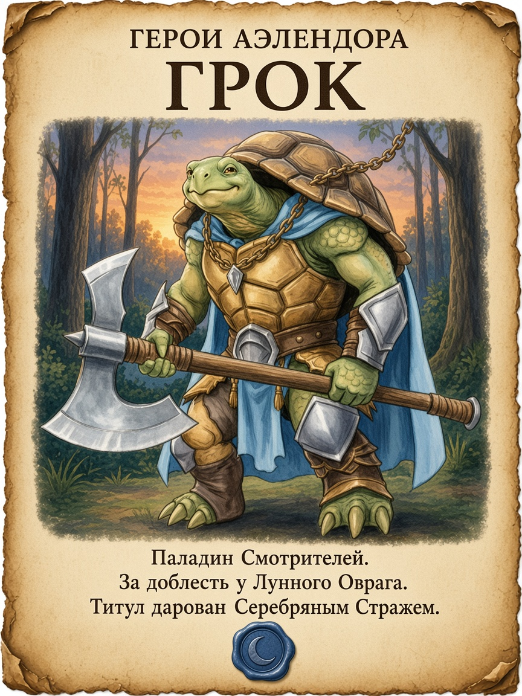

### 2. Герои — Вирра

Референс: [`../images/portraits/virra.png`](../images/portraits/virra.png)  
Фиолетовый мех. Мастер доводит афишу сам.

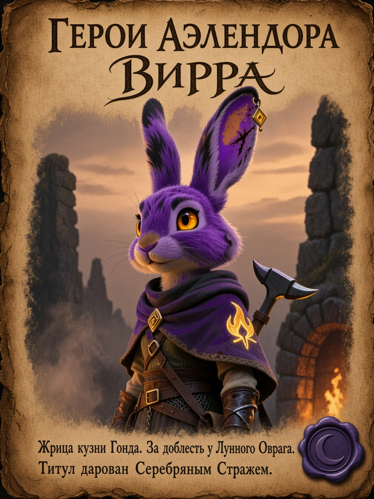

### 3. Герои — Балтан

Референс: [`../images/portraits/baltan.png`](../images/portraits/baltan.png)  
Серо-белый харенгон-бард, пурпурный плащ с зелёной подкладкой, лютня с виноградом.

Текст:

- ГЕРОИ АЭЛЕНДОРА / Балтан
- Бард Коллегии созидания.
- За доблесть у Лунного Оврага.
- Титул дарован Серебряным Стражем.

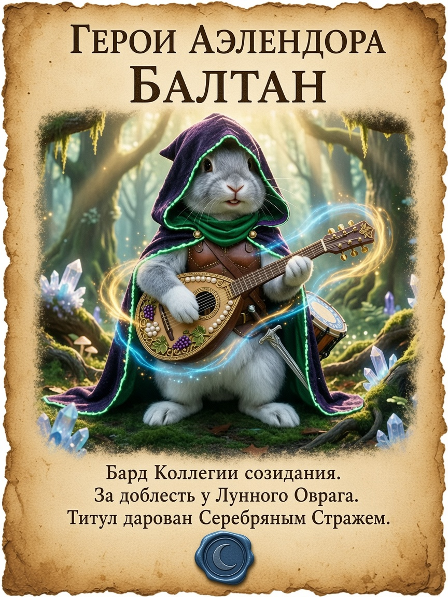

### 4. Герои — Дранник

Референс: [`../images/portraits/drannik.png`](../images/portraits/drannik.png)  
Харенгон-друид Круга мутации: рога, зелёные глаза, посох с зелёной магией.

Текст:

- ГЕРОИ АЭЛЕНДОРА / Дранник
- Друид Круга мутации.
- За доблесть у Лунного Оврага.
- Титул дарован Серебряным Стражем.

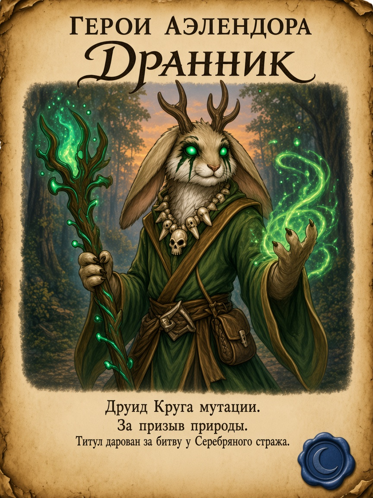

### 5. Герои — Кавил

Референс: [`../images/portraits/kavil.png`](../images/portraits/kavil.png)  
Человек, друид Круга дикого огня: красный плащ, мех на плечах, пламя в ладони.

Текст:

- ГЕРОИ АЭЛЕНДОРА / Кавил
- Друид Круга дикого огня.
- За доблесть у Лунного Оврага.
- Титул дарован Серебряным Стражем.

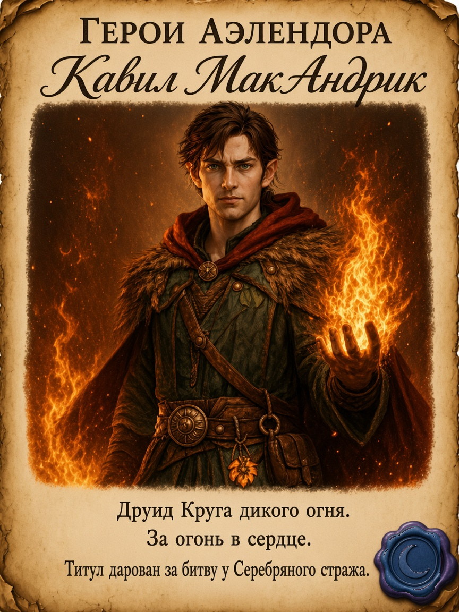

### 6. Герои — Эларион

Референс: [`../images/portraits/elarion.png`](../images/portraits/elarion.png)  
Астральный эльф, чародей драконьей крови: серебряные волосы, фиолетовые глаза, синяя магия в ладони.

Текст:

- ГЕРОИ АЭЛЕНДОРА / Эларион
- Чародей драконьей крови.
- За доблесть у Лунного Оврага.
- Титул дарован Серебряным Стражем.

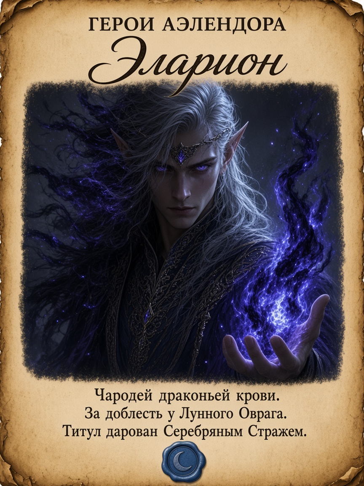

### 7. Герои — Плач звезды

Референс: [`../images/portraits/plach-zvezdy.png`](../images/portraits/plach-zvezdy.png)  
Табакси, мистический ловкач: чёрный мех, голубые светящиеся глаза, капюшон.

Текст:

- ГЕРОИ АЭЛЕНДОРА / Плач звезды
- Мистический ловкач.
- За доблесть у Лунного Оврага.
- Титул дарован Серебряным Стражем.

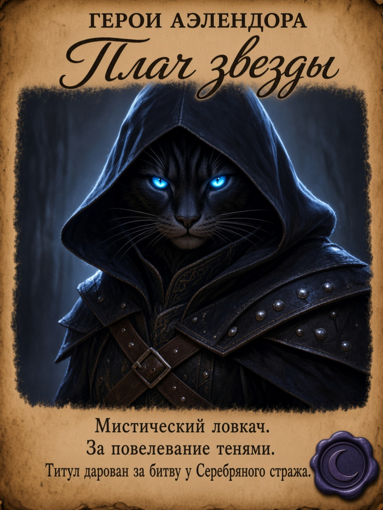

### 8. Розыск — Иннокентий Баль (Кеша)

Референс: [`../images/portraits/innokentiy-bal.png`](../images/portraits/innokentiy-bal.png)  
**Не** герой Аэлендора. Вампир, бьётся руками.

Текст:

- РОЗЫСК / ОСОБО ОПАСЕН / Иннокентий Баль
- Также известен как Кеша.
- Вампир. Бьётся голыми руками.
- Не доверять. Не приближаться.

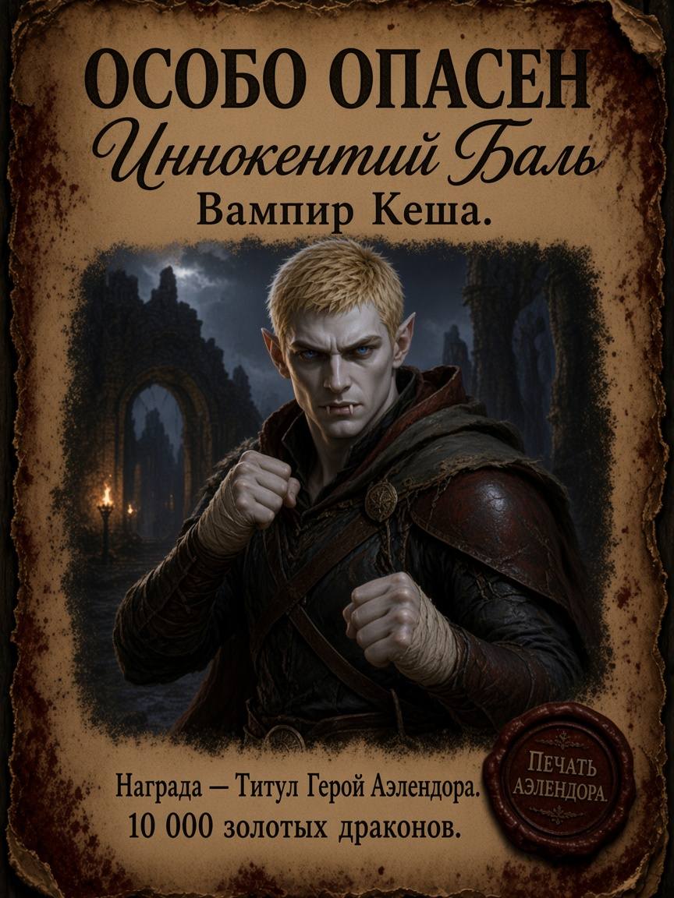

### 9. Рекомендация — Невил

Референс: [`../images/portraits/nevil.png`](../images/portraits/nevil.png)  
**Не** герой Аэлендора. Положительная гражданская пометка.

Текст:

- РЕКОМЕНДАЦИЯ / Невил
- Городской охотник. Убийца монстров.
- Достоин доверия путников и стражи.
- Временно в пути — свадебное путешествие.

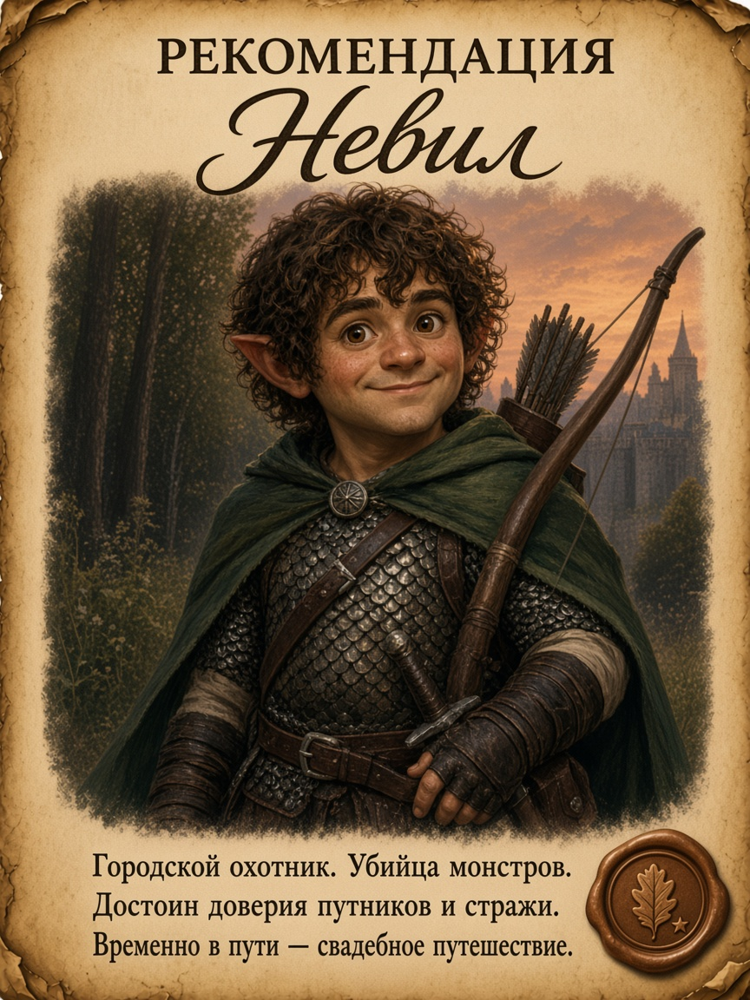

### 10. Розыск — Багал

Референс: [`../images/portraits/bagal.png`](../images/portraits/bagal.png)  
Бывший ПК игрока Элариона. **Не** герой Аэлендора. Убит Кешей.

Текст:

- РОЗЫСК / Багал
- Аасимар-колдун. Пакт исчадия.
- Скрытый антагонист.
- Убит Кешей.

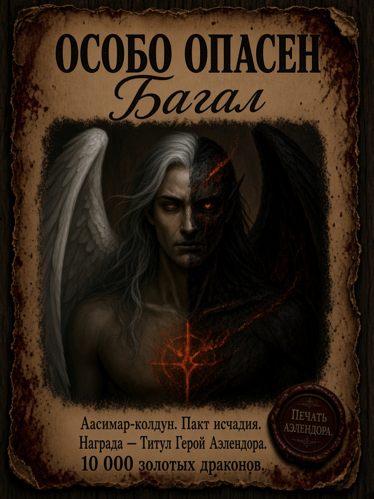

### 11. Добрая память — Мёртвый Лист

Референс: [`../images/portraits/mertvyy-list.png`](../images/portraits/mertvyy-list.png)  
Чарник пока не найден. **Не** герой Аэлендора. Положительная память о павшем спутнике.

Текст:

- ДОБРАЯ ПАМЯТЬ / Мёртвый Лист
- Табакси-плут. Убийца по ремеслу — друг по сердцу.
- Воспитанник Приюта «Колыбель Рассвета».
- Павший в пути. Помним.

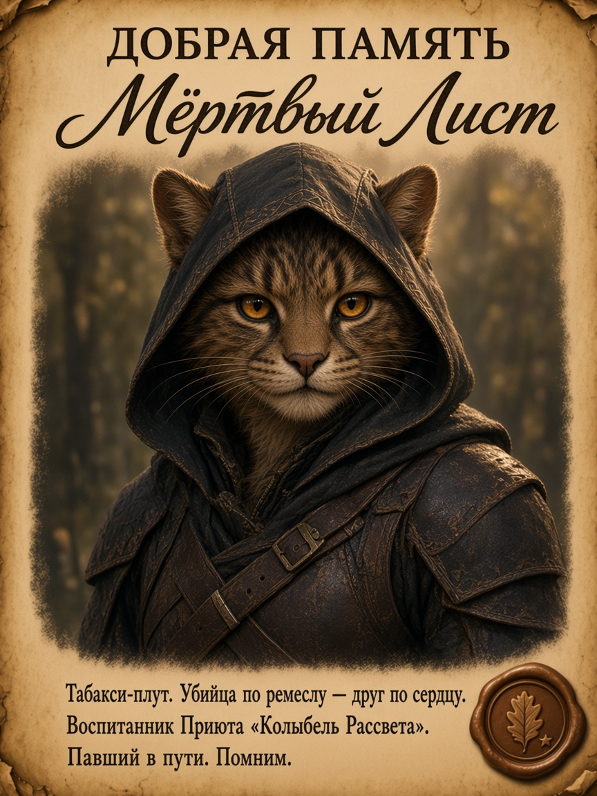

### 12. Розыск — Тиара

Референс: [`../images/portraits/tiara.png`](../images/portraits/tiara.png)  
Ипостась Балтана. **Переметнулась на сторону демонов.** Не герой Аэлендора.

Текст:

- РОЗЫСК / ПРЕДАТЕЛЬНИЦА / Тиара
- Колдун. Пакт исчадия.
- Переметнулась на сторону демонов.
- Ипостась Балтана. Пала у Лунного Оврага.

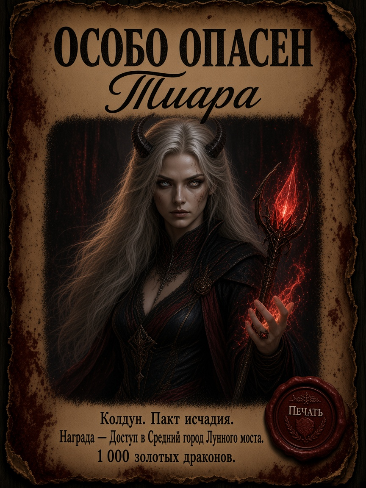

### 13. Служит Хребту — Радонаар

Референс: [`../images/portraits/radonaar.png`](../images/portraits/radonaar.png)  
Выгнан из партии. Служит Империи Драконьего Хребта. Не герой Аэлендора.

Текст:

- СЛУЖИТ ХРЕБТУ / Радонаар
- Драконорожденный-жрец. Домен войны.
- Авангард Империи Драконьего Хребта.
- Вне партии. Пути ещё пересекутся.

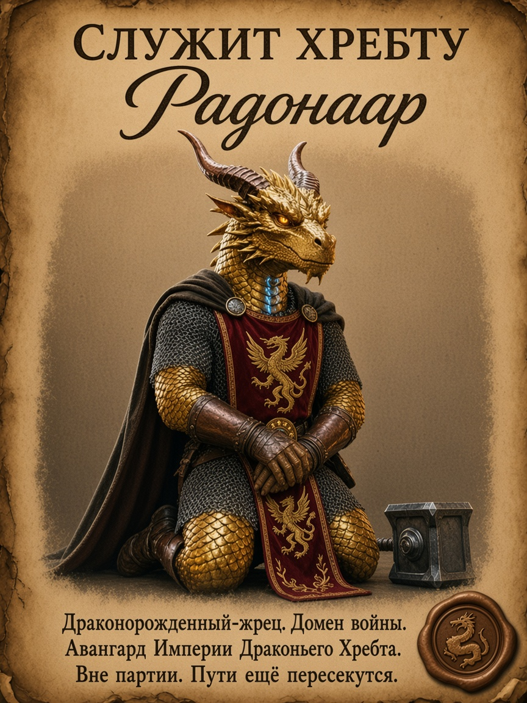

## Кандидаты дальше

**Герои:** общая афиша «Бродяга».  
**Злодеи:** Пиппин, Хвост Скорпиона, Культ Лолс, Константин III.
