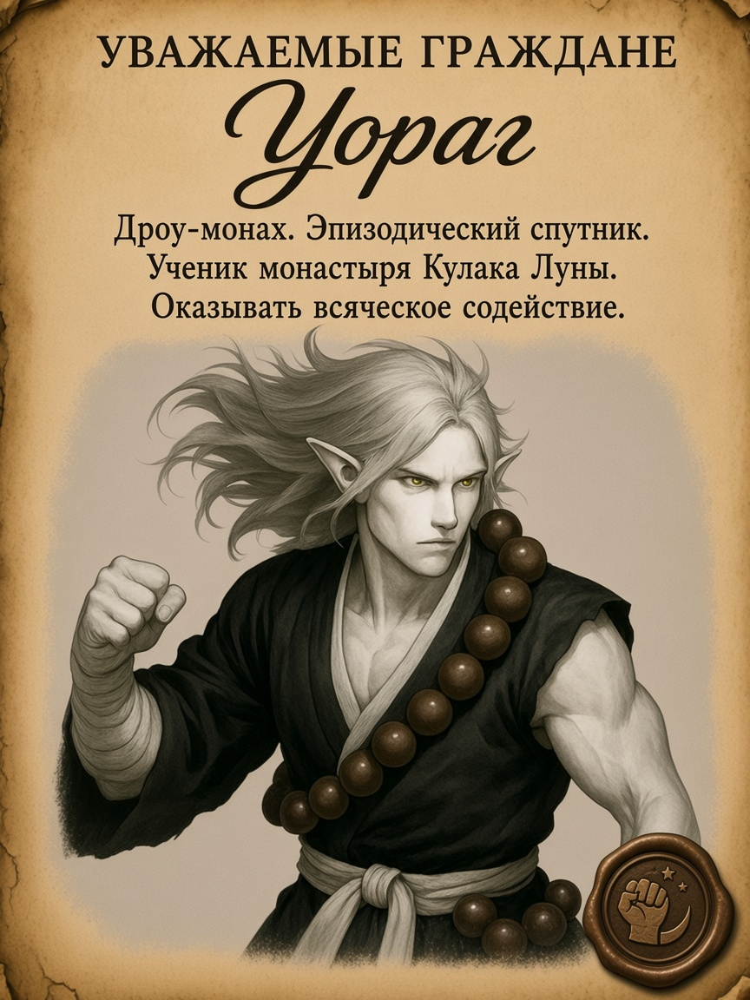
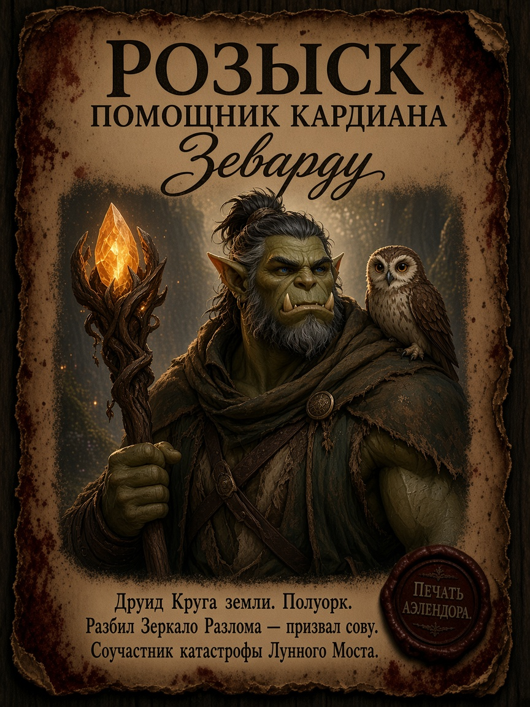
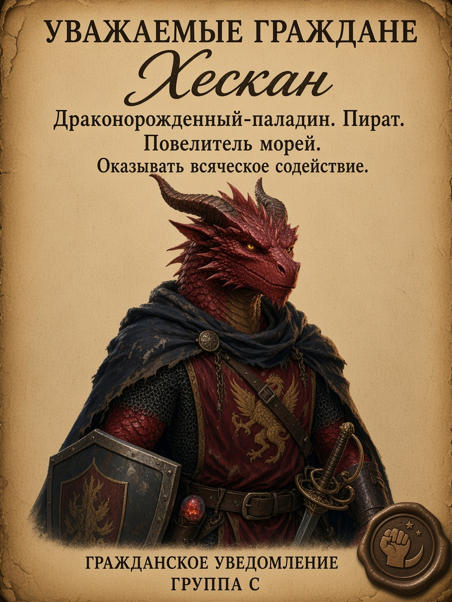
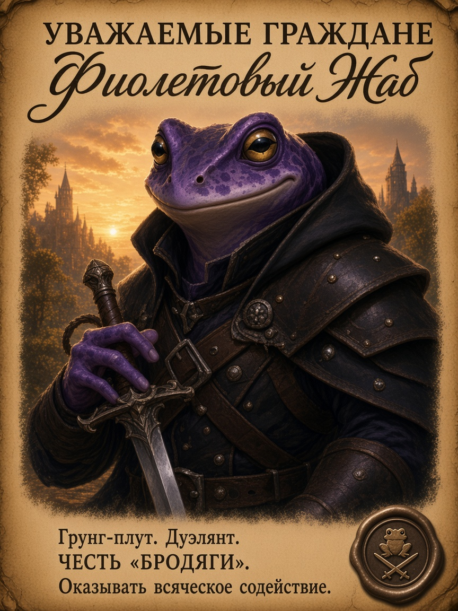

# Пергаментные объявления для игровой комнаты

Идея мастера: развесить по комнате объявления о героях и злодеях **как на пергаменте**.

**Готовые арты:** [`../images/parchment-posters/`](../images/parchment-posters/)  
**Портреты из чарников:** [`../images/portraits/`](../images/portraits/)

## Визуальный канон серии

Опрос текстов: [`poster-text-survey.md`](poster-text-survey.md) · ответы: [`poster-text-answers-2026-09-29.md`](poster-text-answers-2026-09-29.md)

### 4 шаблона (группировка — убрать разнобой)

| | Группа | Заголовок | Сургуч | Файлы |
|---|---|---|---|---|
| **A** | Герои | `ГЕРОИ АЭЛЕНДОРА` | синий · полумесяц | `01`–`07` |
| **B** | Особо опасен | `ОСОБО ОПАСЕН` | красный · печать Аэлендора | `00`, `08`, `10`, `12` (+ `15` Зеварду без правок) |
| **C** | Объявление | `УВАЖАЕМЫЕ ГРАЖДАНЕ` | бронза/серый · одно место | `09`, `13`, `14`, `16`, `17` |
| **D** | Память | `ДОБРАЯ ПАМЯТЬ` | тёплый тёмный | `11` |

Внутри группы: один пергамент, одни поля, одна иерархия шрифтов (**эталон — Вирра**), сургуч в одном углу.

- Текст: **только русский**.
- Вёрстка: заголовок serif CAPS → имя каллиграфией Title Case → портрет → 3 строки serif внизу → сургуч.
- Герои партии: внешность **строго** из [`../images/portraits/`](../images/portraits/).
- Кардиан: лицо из артов снов.
- **Не** писать «ГЕРОИ АЭЛЕНДОРА» на группах B–D.

## Афиши

### 0. Особо опасен — Кардиан

Текст (опрос 2026-09-29):

- ОСОБО ОПАСЕН / Кардиан
- Некромант Мёртвого города.
- Награда — Внесение имени в зал славы.
- 1 000 000 золотых драконов.

### 1. Герои — Грок

Референс: [`../images/portraits/grok.png`](../images/portraits/grok.png)

Текст (опрос 2026-09-29):

- ГЕРОИ АЭЛЕНДОРА / Грок
- Паладин Смотрителей.
- За убийство Громаша.
- Титул дарован за битву у Серебряного стража.

### 2. Герои — Вирра

Референс: [`../images/portraits/virra.png`](../images/portraits/virra.png)  
Фиолетовый мех. Синий сургуч + 3 строки (опрос 2026-09-29).

Текст:

- ГЕРОИ АЭЛЕНДОРА / Вирра
- Жрица кузни Гонда.
- За спасение души.
- Титул дарован за битву у Серебряного стража.

### 3. Герои — Балтан

Референс: [`../images/portraits/baltan.png`](../images/portraits/baltan.png)  
Серо-белый харенгон-бард, пурпурный плащ с зелёной подкладкой, лютня с виноградом.

Текст (опрос 2026-09-29):

- ГЕРОИ АЭЛЕНДОРА / Балтан
- Бард Коллегии созидания.
- За песню победы.
- Титул дарован за битву у Серебряного стража.

### 4. Герои — Дранник

Референс: [`../images/portraits/drannik.png`](../images/portraits/drannik.png)  
Харенгон-друид Круга мутации: рога, зелёные глаза, посох с зелёной магией.

Текст (опрос 2026-09-29):

- ГЕРОИ АЭЛЕНДОРА / Дранник
- Друид Круга мутации.
- За призыв природы.
- Титул дарован за битву у Серебряного стража.

### 5. Герои — Кавил

Референс: [`../images/portraits/kavil.png`](../images/portraits/kavil.png)  
Человек, друид Круга дикого огня: красный плащ, мех на плечах, пламя в ладони.

Текст (опрос 2026-09-29):

- ГЕРОИ АЭЛЕНДОРА / Кавил МакАндрик
- Друид Круга дикого огня.
- За огонь в сердце.
- Титул дарован за битву у Серебряного стража.

### 6. Герои — Эларион

Референс: [`../images/portraits/elarion.png`](../images/portraits/elarion.png)  
Астральный эльф, чародей драконьей крови: серебряные волосы, фиолетовые глаза, синяя магия в ладони.

Текст (опрос 2026-09-29):

- ГЕРОИ АЭЛЕНДОРА / Эларион
- Чародей драконьей крови.
- За успешную подготовку.
- Титул дарован за битву у Серебряного стража.

### 7. Герои — Плач звезды

Референс: [`../images/portraits/plach-zvezdy.png`](../images/portraits/plach-zvezdy.png)  
Табакси, мистический ловкач: чёрный мех, голубые светящиеся глаза, капюшон.

Текст (опрос 2026-09-29):

- ГЕРОИ АЭЛЕНДОРА / Плач звезды
- Мистический ловкач.
- За повелевание тенями.
- Титул дарован за битву у Серебряного стража.

### 8. Розыск — Иннокентий Баль (Кеша)

Референс: [`../images/portraits/innokentiy-bal.png`](../images/portraits/innokentiy-bal.png)  
**Не** герой Аэлендора. Вампир, бьётся руками.

Текст (опрос 2026-09-29):

- ОСОБО ОПАСЕН / Иннокентий Баль
- Вампир Кеша.
- Награда — Титул Герой Аэлендора.
- 10 000 золотых драконов.

### 9. Рекомендация — Невил

Референс: [`../images/portraits/nevil.png`](../images/portraits/nevil.png)  
**Не** герой Аэлендора. Положительная гражданская пометка.

Текст (опрос 2026-09-29):

- УВАЖАЕМЫЕ ГРАЖДАНЕ / Невил
- Городской охотник. Убийца монстров.
- Достоин доверия путников и стражи.
- Оказывать всяческое содействие.

### 10. Розыск — Багал

Референс: [`../images/portraits/bagal.png`](../images/portraits/bagal.png)  
Бывший ПК игрока Элариона. **Не** герой Аэлендора. Убит Кешей.

Текст (опрос 2026-09-29):

- ОСОБО ОПАСЕН / Багал
- Аасимар-колдун. Пакт исчадия.
- Награда — Титул Герой Аэлендора.
- 10 000 золотых драконов.

### 11. Добрая память — Мёртвый Лист

Референс: [`../images/portraits/mertvyy-list.png`](../images/portraits/mertvyy-list.png)  
Чарник пока не найден. **Не** герой Аэлендора. Положительная память о павшем спутнике.

Текст:

- ДОБРАЯ ПАМЯТЬ / Мёртвый Лист
- Табакси-плут. Убийца по ремеслу — друг по сердцу.
- Воспитанник Приюта «Колыбель Рассвета».
- Павший в пути. Помним.

### 12. Розыск — Тиара

Референс: [`../images/portraits/tiara.png`](../images/portraits/tiara.png)  
Ипостась Балтана. **Переметнулась на сторону демонов.** Не герой Аэлендора.

Текст (опрос 2026-09-29):

- ОСОБО ОПАСЕН / Тиара
- Колдун. Пакт исчадия.
- Награда — Доступ в Средний город Лунного моста.
- 1 000 золотых драконов.

### 13. Служит Хребту — Радонаар

Референс: [`../images/portraits/radonaar.png`](../images/portraits/radonaar.png)  
Выгнан из партии. Служит Империи Драконьего Хребта. Не герой Аэлендора.

Текст (опрос 2026-09-29):

- УВАЖАЕМЫЕ ГРАЖДАНЕ / Радонаар
- Драконорожденный-жрец. Домен войны.
- Авангард Империи Драконьего Хребта.
- Оказывать всяческое содействие.

### 14. Известен — Уораг

Референс: [`../images/portraits/uorag.png`](../images/portraits/uorag.png)  
Эпизодический. Нейтральное упоминание. Не герой Аэлендора.

Текст (опрос 2026-09-29):

- УВАЖАЕМЫЕ ГРАЖДАНЕ / Уораг
- Дроу-монах. Эпизодический спутник.
- Ученик монастыря Кулака Луны.
- Оказывать всяческое содействие.

### 15. Розыск — Зеварду (помощник Кардиана)

Референс: [`../images/portraits/zevardu.png`](../images/portraits/zevardu.png)  
Разбил Зеркало Разлома (призвал сову). В объявлениях — помощник Кардиана.

Текст:

- РОЗЫСК / ПОМОЩНИК КАРДИАНА / Зеварду
- Друид Круга земли. Полуорк.
- Разбил Зеркало Разлома — призвал сову.
- Соучастник катастрофы Лунного Моста.

### 16. Известен — Хескан

Референс: [`../images/portraits/heskan.png`](../images/portraits/heskan.png)  
Проходной. Нейтральное упоминание. Не герой Аэлендора.

Текст (опрос 2026-09-29):

- УВАЖАЕМЫЕ ГРАЖДАНЕ / Хескан
- Драконорожденный-паладин. Пират.
- Повелитель морей.
- Оказывать всяческое содействие.

### 17. Честь «Бродяги» — Фиолетовый Жаб

Референс: [`../images/portraits/fioletovyy-zhab.png`](../images/portraits/fioletovyy-zhab.png)  
Основатель партии. Сейчас не играет. Очень положительная подача (выше нейтрального «известен» / рекомендации Невила). Не титул «Герои Аэлендора» — отдельная честь группы.

Текст (опрос 2026-09-29):

- УВАЖАЕМЫЕ ГРАЖДАНЕ / Фиолетовый Жаб
- Грунг-плут. Дуэлянт.
- ЧЕСТЬ «БРОДЯГИ».
- Оказывать всяческое содействие.

## Кандидаты дальше

**Герои:** общая афиша «Бродяга».  
**Злодеи:** Пиппин, Хвост Скорпиона, Культ Лолс, Константин III.
