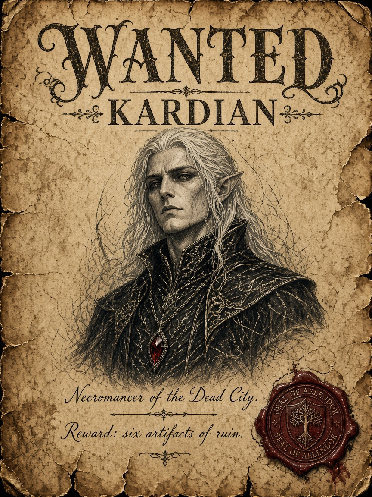
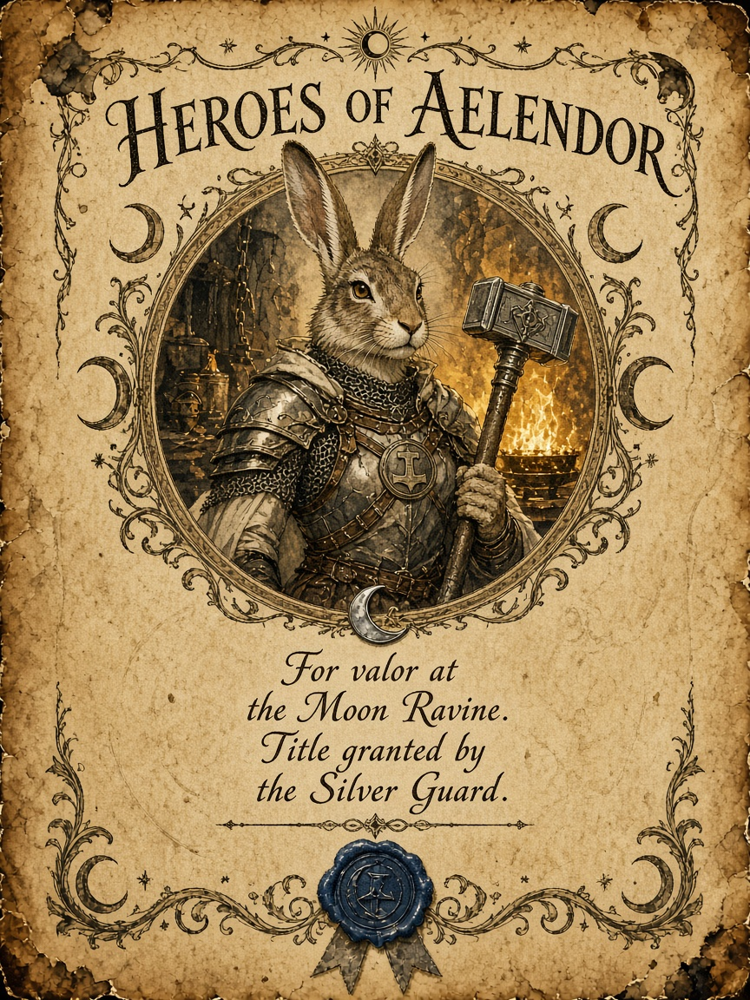

# Пергаментные объявления для игровой комнаты

Идея мастера: развесить по комнате объявления о героях и злодеях **как на пергаменте** — таверные/городские афиши мира «Эхо рассвета».

## Визуальный канон серии

- Носитель: **состаренный пергамент** (не глянцевый постер, не современная бумага).
- Края: рваные / подпалённые / «гвоздём к доске».
- Фактура: пятна, трещины, сепия, следы воска.
- Портрет: гравюра / чернильный набросок / медальон в рамке.
- Печать: сургуч (Аэлендор / Серебряный Страж / фракция).
- Формат печати: **вертикаль 3:4** (удобно вешать).
- Язык на картинке (пробы): английский для читаемости генератора; для финала можно накладывать кириллицу в вёрстке или перегенерировать под конкретные надписи.

## Пара промптов (пробы)

### 1. Розыск — Кардиан

> Vertical fantasy wanted poster printed on aged parchment paper. Irregular torn edges, coffee-brown stains, foxing spots, subtle cracks in the surface, as if hung for years in a tavern. Top header in ornate dark-ink calligraphy reading WANTED, beneath it the name KARDIAN. Center: half-length portrait of a pale aristocratic elven necromancer with hollow eyes, black ceremonial robes, faint silver veins of magic, a teardrop blood-red crystal amulet, candlelit from below. Thin ink sketch hatching around the portrait like a medieval woodcut. Bottom text lines in old quill handwriting: Necromancer of the Dead City. Reward: six artifacts of ruin. Seal of Aelendor wax stamp in the corner, cracked red wax. Mood: dark fantasy Dungeons and Dragons prop, photoreal parchment texture, no modern paper, no glossy poster look, no purple neon glow.

### 2. Герои Аэлендора — Вирра

> Vertical fantasy royal proclamation poster on warm aged parchment. Soft cream-to-amber paper with deckled edges, faint watermark grain, mild burn marks at corners, as if nailed to a village board. Top ornate calligraphy header reading HEROES OF AELENDOR. Center portrait medallion of a proud harefolk (harengon) cleric-forge priestess named Virra: tall rabbit-eared warrior-priestess in burnished forge-blessed armor, holy hammer, warm golden forge light, noble heroic expression. Surrounding decorative ink flourishes of moonbridge motifs and a small silver crescent pin. Quill-written lines below: For valor at the Moon Ravine. Title granted by the Silver Guard. Small cracked blue wax seal. Style: medieval illuminated manuscript meets D&D tavern notice, rich parchment texture, hand-drawn ink and sepia wash, no modern graphic design, no cards, no neon, no purple.

## Кандидаты на серию

**Герои / прокламации**

| Тема | Заметка |
|---|---|
| Вирра | жрец кузни, Лассо Гонда — проба готова |
| Грок | паладин, секира «Кровавая Эшонай» |
| Балтан | бард; можно «афиша театра Зеркало Судьбы» |
| Дранник / Кавил / Плач звезды / Эларион | отдельные медальоны или общая афиша партии |
| Контактный зоопарк «Бродяга» | групповое объявление «Герои Аэлендора» |

**Злодеи / розыск**

| Тема | Заметка |
|---|---|
| Кардиан | главный антагонист — проба готова |
| Пиппин | предатель (мёртв) — «архив закрытого дела» |
| Багал | мёртв; интрига вокруг имени |
| Хвост Скорпиона | не портрет, а знак + награда |
| Культ Лолс | жуткая листовка без лица |
| Константин III | ложная корона — политический розыск |

## Печать

Для комнаты: PDF A3/A4 на **матовой бумаге** цвета ivory / parchment, или обычная печать + лёгкая тонировка чаем/кофе по краям. Сургуч и нить — опционально как физический декор поверх принта.
