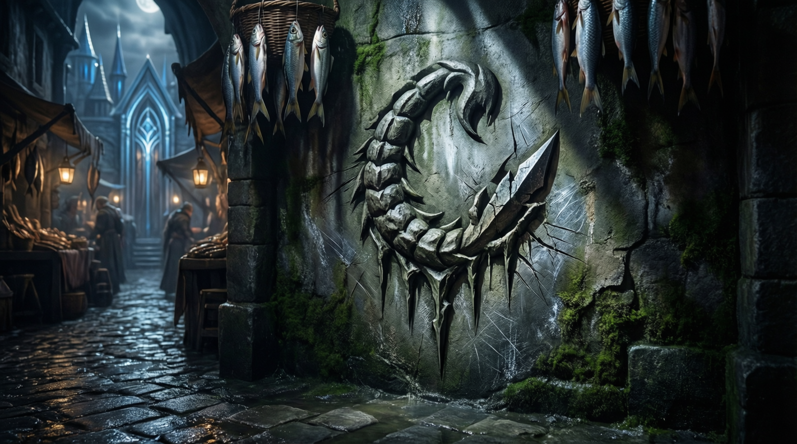

# Промпт: знак «Хвоста Скорпиона»

Запрошен мастером для картинки знака банды на стене рынка в Лунном Мосте. Мастер ответил «Отлично».

## English prompt

> A clandestine gang symbol carved into a damp stone wall in a shadowy alley of a bustling fantasy marketplace. The symbol is the "Scorpion's Tail" — a stylized, sinuous scorpion tail curling into a sharp stinger, with three jagged lines beneath it representing venom drops. The design is crude yet deliberate, scratched with a knife or dagger, partially hidden behind hanging fish baskets and wet cobblestones. The wall is mossy, stained with salt and grime, typical of the Moonbridge district — an elven port city with silver-blue architectural accents faintly visible in the background. Moody, cinematic lighting with deep shadows and a single shaft of pale moonlight highlighting the symbol. Style: dark fantasy, Dungeons & Dragons, gritty realism, detailed street-level worldbuilding.

## Подсказки генерации

- Aspect: 16:9 или 3:2  
- Mood: тревожный, таинственный  

## Визуальный канон знака (из промпта)

Стилизованный хвост скорпиона с жалом + три зубчатые линии «капель яда» снизу; выцарапан на сырой каменной стене у рыбных прилавков.

## Сгенерированное изображение

Сохранено локально (не полагаться на CDN Qwen):

