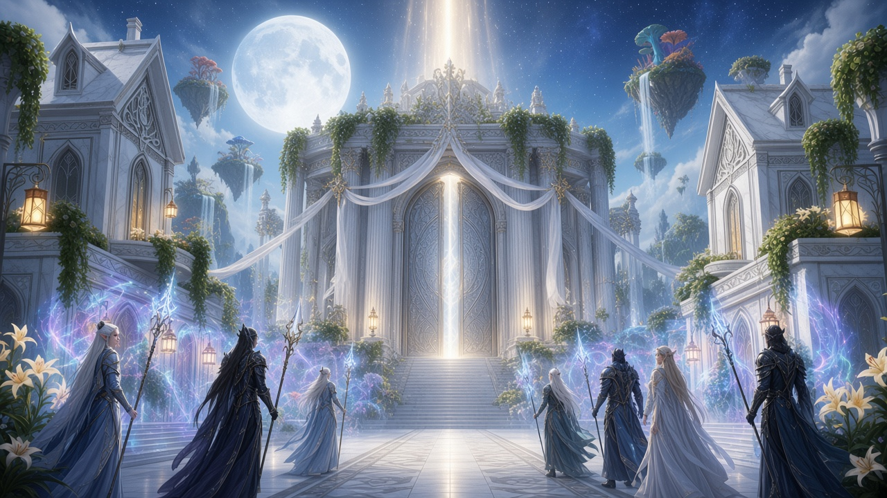
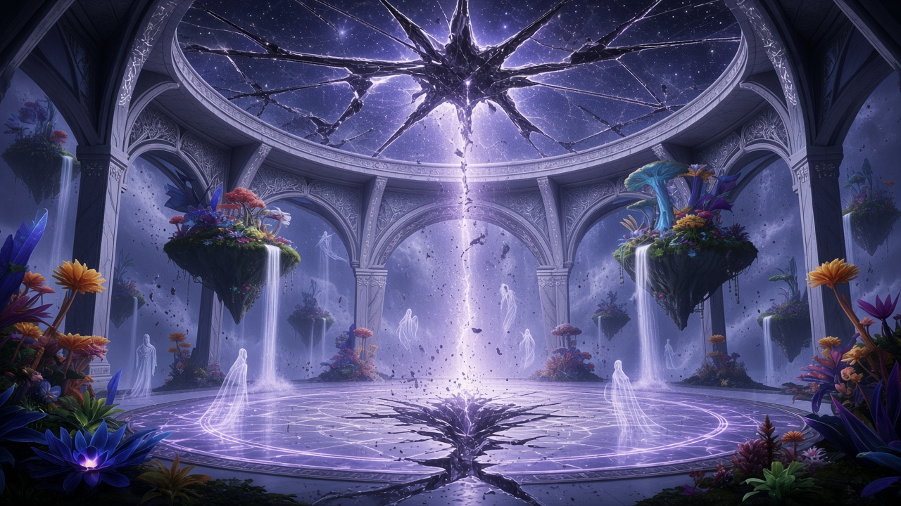
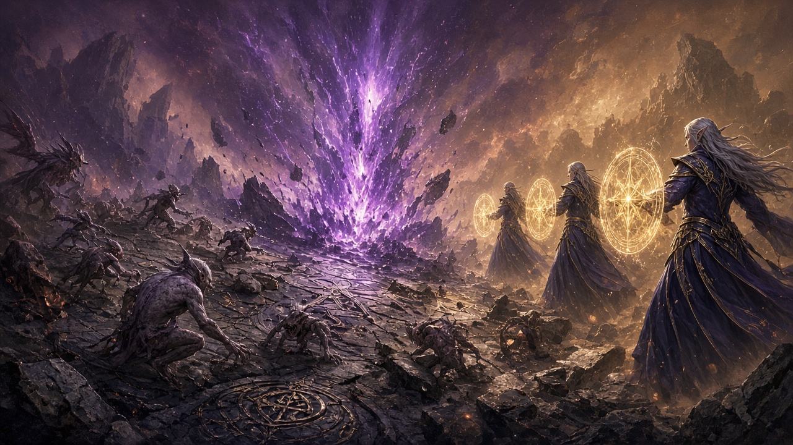
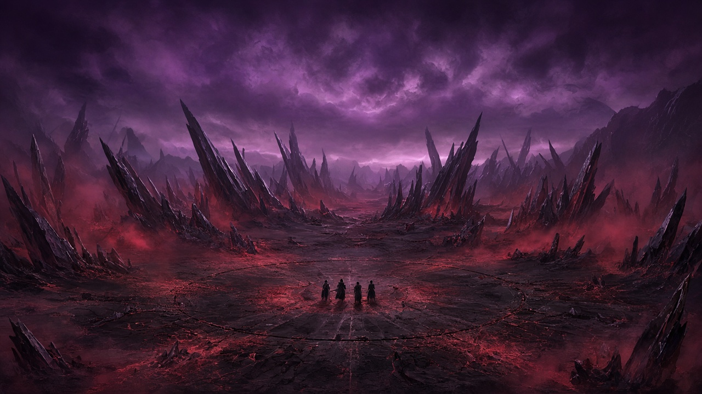
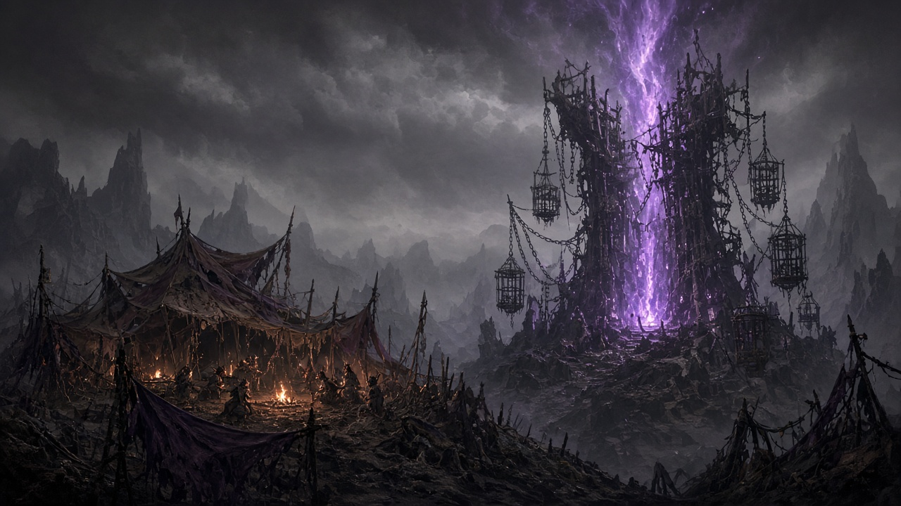
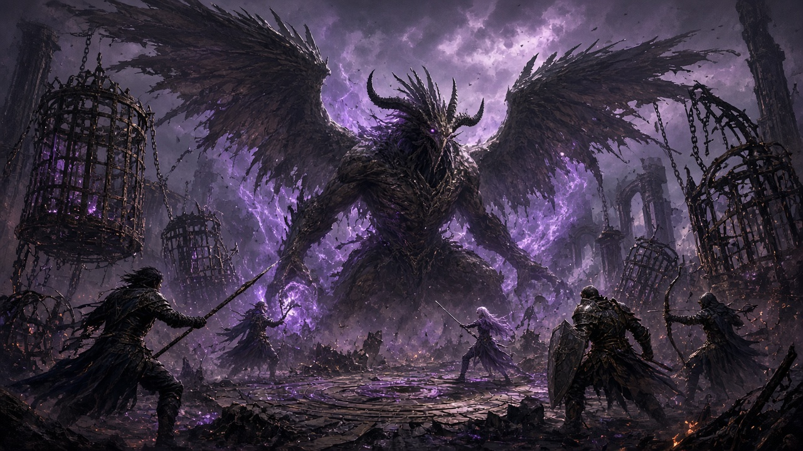
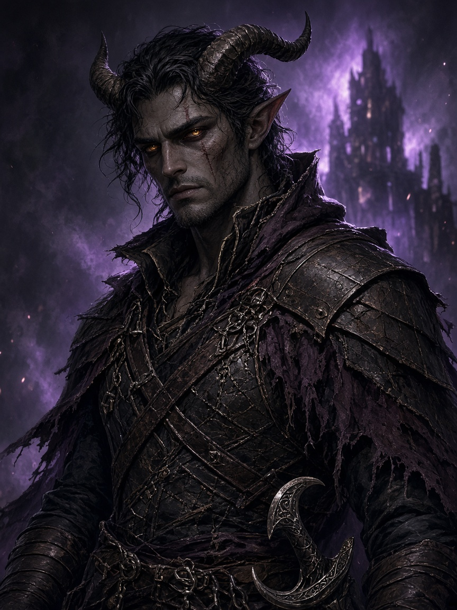
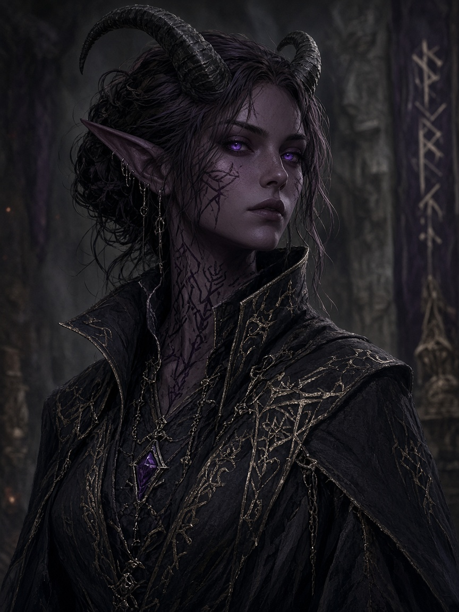
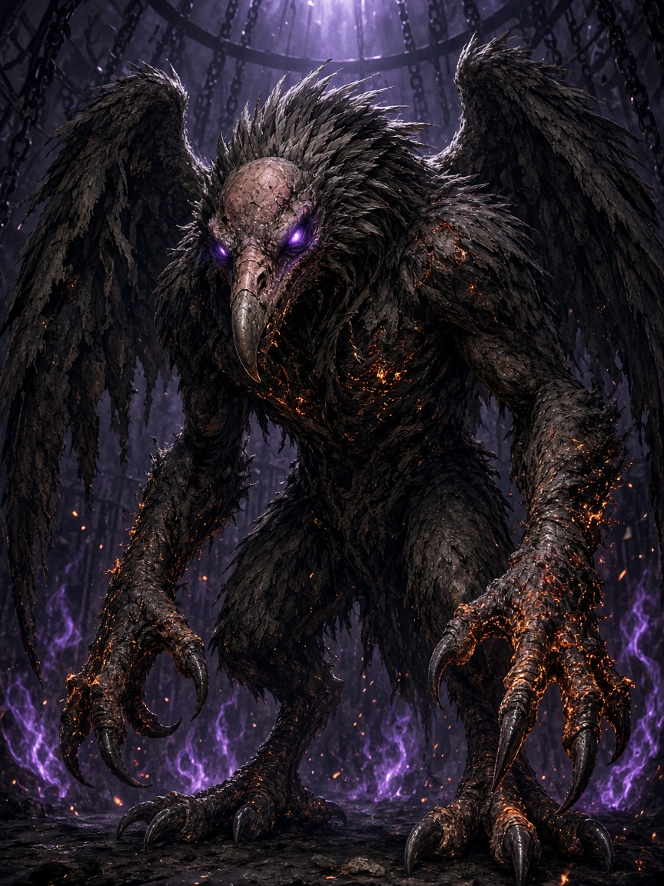

# 3 · Дверь A · Маяк душ

**Открой, если после похорон выбрали Разлом (фиолетовый поток).**

# СЕССИЯ 2 — «Рана в Купели» (дверь A · фиолетовый поток)

**Цель:** **социал** (одобрение магов) → открытие потока → **выброс врагов** → проход → пустошь → **Маяк душ** → исход с Сарель.  
**Не цель:** Алтарь / Филактерий / Око / Кардиан.  
*(Дверь F / чёрный поток = mq-04; полный скрипт: [глава 4 · Дверь F](04-dver-f.md).)*

**Длина:** 3.5–4.5 ч (добавлен бой открытия).

## Биты

| # | Бит | Мин |
|---:|---|---|
| 2.0 | Подход | 5 |
| 2.1 | Социал + инструктаж (одобрение) | 20–30 |
| 2.2 | Осмотр раны | 10–15 |
| 2.3 | **Открытие потока → выброс демонов** | 15–25 |
| 2.4 | Проход (сейвы + заплыв) | 25–40 |
| 2.5 | Приземление | 5 |
| 2.6 | Маяк / Сарель / охотник | 40–70 |
| 2.7 | Клифф | 5 |

---

### 2.0 — Подход

> **Кадр:** Подход к Купели

#### Элиан Вечный Узел
*одобрение потока*

> **Кадр:** Элиан Вечный Узел

#### Ваэра Ночной Клинок
*дроу-хранитель*

> **Кадр:** Ваэра Ночной Клинок

**Сказать:**

> Купель Вечных Звёзд пахнет озоном и мокрой пылью, не благовониями. У ступеней — кордон: эльфы-маги в серебряных перевязях и **дроу** с копьями, на которых выжжен знак Зеркала. Паломников нет.

Perception 12: в лазарете стоны тех, кого обожгло плетение.

---

### 2.1 — Социал: одобрение магов + инструктаж

| Кто | |
|---|---|
| **Тандил** | зачем пускают; напоминает про два потока (уже сказал в 1.4) |
| **Элиан Вечный Узел** | правила; **открывает** выбранный поток; **одобрение** |
| **Ваэра Ночной Клинок** | не пустит без печати Элиана |

**Лок:** вход только с одобрения магов. Путь = **социальный** (договор), не штурм Купели.

#### Тандил

> Я не отправляю вас «посмотреть дыру». Мне нужен факт: что там держит напор — и чтобы вы **вернулись**.  
> Маэстро бы пошёл первым. Маэстро мёртв. Слушайте Элиана. Без его слова шаг внутрь я оформлю как самоубийство, не как героизм.  
> Сегодня просите **фиолетовый** поток — план демонов. Чёрный не трогаем, пока не скажете иное: туда ушёл Велиан, и открытие чёрного вытащит **мёртвых** в этот зал.

#### Элиан

> Здесь стояло Зеркало. Теперь — **рана**. Плетение держит края; дроу — клятву крови со времён целого Зеркала.  
> Мы открываем поток. Не «прыгаете в цвет». **Мы** тянем нить — фиолетовую или чёрную. Сегодня, если согласимся: **демоны**.  
> Когда поток встаёт — рана **отвечает**. Из неё лезет то, чей план зовёте. Будьте готовы драться **здесь**, в Купели, до входа.  
> Проход ≈ пять минут. Невесомость. Фиолетовые сгустки. Держитесь холодной звезды-выхода.  
> На той стороне — пустошь и **Маяк душ**: там жгли пленных. Легион, говорят, бросил маяк. Не ждите договора с Бездной.  
> Условия: (1) не рвать руны сдерживания изнутри без нужды; (2) метка возврата — один осколок Купели на группу; (3) перевязать кровотечение до входа.

#### Одобрение = социальный узел (обязателен)

| Путь | Как | Итог |
|---|---|---|
| **A · Договор** | Уважение к Ваэре + ясные цели + согласие с условиями Элиана | печать + метка; Элиан открывает поток |
| **B · Торг** | Persuasion **15** (или Insight 14 → Persuasion 13): «город / низ / возврат») | как A |
| **C · Поручитель** | Тандил: «я поручитель» — если партия сорвала тон, но не хамила Ваэре | как A; долг Тандилу |
| **Провал** | Хамство / «сломаем рану» / отказ условий | вход закрыт **сегодня** → mq-01 liveliness +1; выброс без партии всё равно может случиться за кадром |

Провал торга + хамство: вход закрыт **сегодня** → mq-01 liveliness +1.

**Одобрение даёт:** метка (серебряный осколок, action: раз в день Advantage на сейв vs выброс раны при возврате — вкус).

#### Ваэра (коротко)

> Клятва старше вашего фестиваля. Рану не «побеждают» мечом с этой стороны. Идите — или уйдите. Не топчите руны.

---

### 2.2 — Осмотр раны

> **Кадр:** Фиолетовая рана Зеркала

**Сказать:**

> Половина купола цела. Половина — чёрная паутина трещин в холодном серебре. В центре воздух **разрезан**: серебряная рана на месте Зеркала. Пепел падает вверх и снова вниз. За плёнкой — фиолетовая тишина *(пока поток не открыт)*. Крыло архива — обвал. Кельи = лазарет.

| Навык | DC | Результат |
|---|---|---|
| Arcana | 14 | плетение живое; удар по рунам = выброс в город (4к10 force в радиусе, сюжетно катастрофа) |
| Religion | 14 | клятва дроу древнее текущего Разлома |
| Investigation | 13 | отчёт: трое лезли без метки — двое трупы с пустыми глазами, один «поёт фиолетовым» в лазарете |
| Medicine | 12 | кровь усиливает дрожь краёв |
| Perception | 15 | за раной на миг — силуэт клетки/цепей (Маяк) |

Поговорить с обожжённым в лазарете (**Илвесс**, эльф-маг): «Сгустки… как рыбы. Не трогай руками. Голос предлагал силу. Я сказал нет. Руки всё равно горят.»

---

### 2.3 — Открытие потока → выброс (демоны)

> **Кадр:** Выброс демонов

**После одобрения.** Элиан + 2 мага тянут фиолетовую нить. Партия стоит у ступеней / рун (Ваэра: «не в плетение»).

**Сказать:**

> Серебряная рана вспыхивает **фиолетовым**. Пепел летит горизонтально. Из разреза — запах серы и горячей меди. Что-то **выходит в зал**, пока поток ещё не держит форму.

#### Бой — выброс открытия (Купель)

| Сост | Статы |
|---|---|
| Волна | **3× дретч** ([dnd.su](https://dnd.su/bestiary/66-dretch/)) |
| Лидер волны | **1× квазит** ([dnd.su](https://dnd.su/bestiary/68-quasit/)) — скачет по рунам, не рвёт плетение |
| Тактика | дретчи на ближайших; квазит — невидимость → удар по кастеру/хилеру; руны = труднопроходимая полоса (не ломать) |
| Союзники | Ваэра держит периметр (не умирает); 1 маг Элиана может *Sacred Flame*-эквивалент раз в раунд по дретчу |
| Победа | поток **стабилен** — фиолетовая тишина зовёт внутрь |
| Бегство партии | поток схлопывается; вход сегодня закрыт; город +1 раненый маг |

*(Чёрный поток / mq-04: вместо демонов — **мертвецы + некромант**; тот же бит, другие статы — в spine mq-04.)*

---

### 2.4 — Проход

> **Кадр:** Фиолетовый проход

**Сказать при входе:**

> Город гаснет, как свеча под ладонью. Невесомость. Фиолетовые сгустки плывут и зудят по коже. Вдалеке — холодная звезда выхода. Магия шумит в зубах.

Лок: *../../../../plot/canon-lock-2026-09-22-sessions12-mechanics.md*

#### A. Три сейва (по порядку, каждый ПК)

| # | Сейв | DC | Провал → до длинного отдыха |
|---:|---|---|---|
| 1 | Con | **15** | весь урон **×2** |
| 2 | Int | **15** | ячейки **×½** вниз по уровням; нет ячеек → помеха Int checks/saves |
| 3 | Wis | **16** | **−10** Perception |

Открытая кровь → помеха на Con; при провале Con — фраза мёртвого (mq-04).

**Вкусы успехов (сказать коротко):**  
Con: «Давление есть — кости держат.»  
Int: «Карта планов мелькает и гаснет — ты не тонешь.»  
Wis: «Голос предлагает силу за колено. Ты не кланяешься.»

#### B. Заплыв — индивидуально, DC 14

Athletics / Acrobatics / Arcana / Religion / Insight — **один** бросок на ПК.

| Исход | Эффект |
|---|---|
| Успех | чистый выход; обычный Dex |
| Провал | 1к8 force; **помеха** на Dex |
| Провал на 5+ | + *blinded* до конца след. хода после посадки **или** буксир (союзник-успех, реакция, Athletics 12): снять помеху Dex, оба по 1к4 force |
| Нат. 1 | как провал 5+; без буксира — blinded + помеха |

*Провал сказать:* «Свет уезжает. Сгусток хлещет. Пустота всё равно вытолкнет — кувырком.»

---

### 2.5 — Приземление

> **Кадр:** Пустошь · приземление

**Сказать:** «Вас выплёвывает в воздух над чужой землёй.»

Dex DC **13** → провал **2к8** дробящего.  
Учесть ×2 и помеху.

---

### 2.6 — Маяк душ

> **Кадр:** Маяк и лагерь изгоев

> **Кадр:** Бой у клеток

#### Сарель Пепельный Договор
*лидер изгоев*

> **Кадр:** Сарель Пепельный Договор

#### Кеш
*молодой изгой*

> **Кадр:** Кеш

#### Орра
*руны*

> **Кадр:** Орра

#### Сборщик Огарков
*босс*

> **Кадр:** Сборщик Огарков

**Side (не spine):** seed [`../../../locations/mayak-dush/`](../../../locations/mayak-dush/) · q-mayak-01…03. Ворота Купели: q-kupel-01…02 в [`../../../locations/lunnyy-most/quests/`](../../../locations/lunnyy-most/quests/).

**Сказать:**

> Пепельно-багровая пустошь. Небо-синяк. Зубцы чёрного стекла. Запах меди и горячего камня.  
> Вдалеке — грязно-фиолетовый столб: **Маяк душ**. Клетки, цепи, выжженные круги. Тихо. Слишком тихо.

**Первые 30 секунд:** Survival/Perception 12 — следы копыт и волочения к маяку; свежие — тифлиньи; старше — демонические, уходят к дымам на горизонте.

#### Лагерь изгоев

| НПС | |
|---|---|
| **Сарель Пепельный Договор** | лидер; язвительная |
| **Кеш** (тифлинг, молодой) | дрожит; «Оно нюхает нас по ночам» |
| **Орра** (тифлинг, бывший культист) | молчит; знает руны маяка |
| +1–2 безымянных | прячутся в остове клетки |

**Сарель:**

> Легион бросил дыру. Нам не легче: мелочь, что осталась *охотиться*, чует нас.  
> Нужен проводник — уберите то, что нас нюхает. Нет — сдыхайте сами. Силой гнуть можно… карта в голове у того, кто дышит.

Insight 14: угроза реальна; она не блефует про проводку.

#### Три пути (закрыть до клиффа)

| Путь | Как закрыть | DC / бой |
|---|---|---|
| **A Социал** | «Поможем — ведёшь» | Persuasion 15 → обязаны драться с охотником; после победы ведёт |
| **B Бой** | Сразу защитить лагерь | бой ниже → ведёт из расчёта |
| **C Сила** | Заставить без помощи | Intimidation 17 **или** бой до сдачи vs тифлингов (Сарель HP 45, AC 15, scimitar +5 1к6+3; Кеш/Орра = Bandit) → ведёт злобно; **предательство** на развилке позже (отметить) |
| **Отказ** | Уйти | Survival 16 каждый переход без проводника; маяк падёт за кадром |

#### Бой — охотник (финал стола)

**Имя:** **Сборщик Огарков** — **врок** [Vrock](https://dnd.su/bestiary/75-vrock/), оставленный «подметать» души у брошенного маяка.

| Сост | Статы |
|---|---|
| Сборщик | **Врок** (dnd.su / MM); HP можно −20 если партия в тяжёлых дебаффах прохода |
| Помощь | **2× дретч** ([dnd.su](https://dnd.su/bestiary/66-dretch/)) — выходят на 2-м раунде с фланга клеток |
| Тактика | раунд 1: Сборщик на тифлингов (Сарель в приоритете); крик Сарель — «не дайте ему петь!» = сбить **Споры** (*Spores*, действие врока) / прервать концентрацию |
| Победа | Сборщик падает; дретчи бегут к дымам |
| Сарель 0 HP | проводник потерян, если нет Орры (Persuasion 16 уговорить Орру вести за полцены-страха) |

**Поле:** полуразрушенный круг ритуала — труднопроходимая местность в клетках; свет маяка даёт dim light 30 фт.

**Трофеи:** 80 зм в пыли клеток; **осколок души-цепи** (uncommon focus: 1/день Advantage на Intimidation vs fiend 1 мин); карта-царапина Сарель: «дым / кровь / не сюда».

---

### 2.7 — Клифф

> **Кадр:** Клифф · дымы к Алтарному тракту

**Сказать:**

> С обломка маяка — цепь дымов, где пустошь густеет. Сарель (если ведёт) кивает: «Туда легион жрёт кровь. Новое место силы. Сюда они не вернутся, пока есть кого жечь там.»  
> Кардиана нет. Маяк за спиной мерцает слабее.

**Новость:** легион переехал к Алтарному тракту = сессии 3–7 spine.

### XP сессии 2

| | |
|---|---|
| Мобы | по MM (включая выброс открытия) |
| `xp_quest` | 2500–3500 |
| `xp_personal` | 250–500 (Вирра / Грок / кастер на Int) |

---

## Если не дверь A

Сессия 2 **не** этот файл. После похорон:

| Дверь | Prep следующего |
|---|---|
| B/C | mq-05 + book-chapter / Милана |
| D | [глава 5 · Дверь D](05-dver-d.md) (камень · Порог · Силвания/Малфурион) |
| E | mq-06 акт 0 |
| F | [глава 4 · Дверь F](04-dver-f.md) (жертва · выброс undead · Причал + Лайра) |

---

## Чеклист мастера «мелочи»

- [ ] Слухи до игры выданы  
- [ ] Выбран 1 боковой очаг  
- [ ] Речи Селенис + Тандил  
- [ ] Кольцо / Милана  
- [ ] Дверь названа вслух; если A/F — Тандил про **два потока**  
- [ ] 1 новость мира  
- [ ] Если A: **социал** одобрения → **выброс демонов** → метка → 3 сейва → заплыв → Dex → Маяк → путь A/B/C/отказ → Сборщик  
- [ ] Опц. side Купели / Маяка (не блокируют клифф)  
- [ ] Дебаффы прохода записаны на листах до длинного отдыха  

**Дальше на круге 1:** случайные вставки легиона — *(вставки — позже / liveliness)*

---

[Оглавление](../README.md) · ← [2 · Сессия 1](02-sessiya-1-pokhorony.md) · Далее → [4 · Дверь F](04-dver-f.md)
