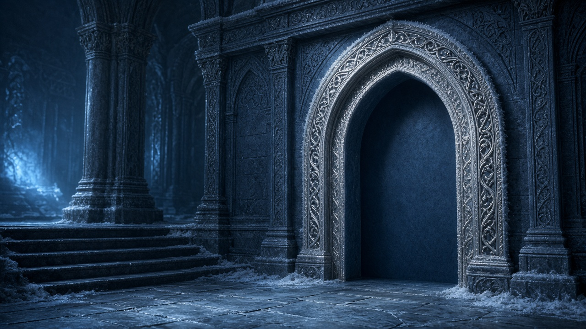
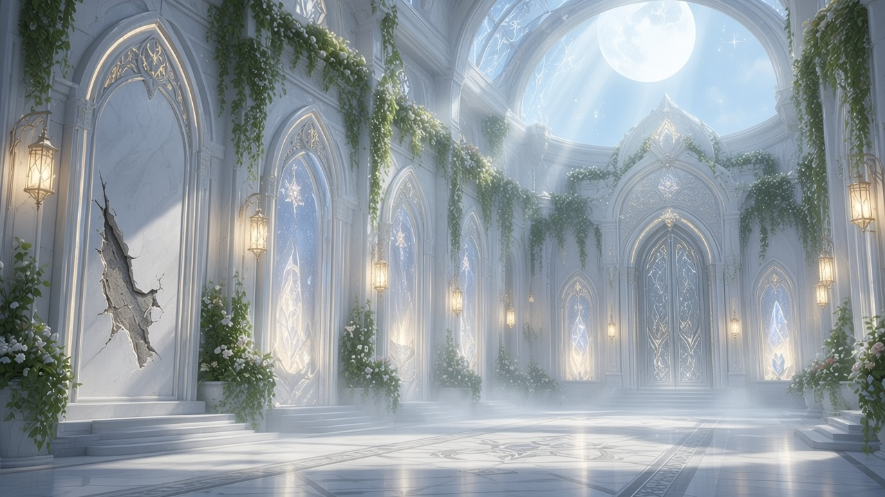
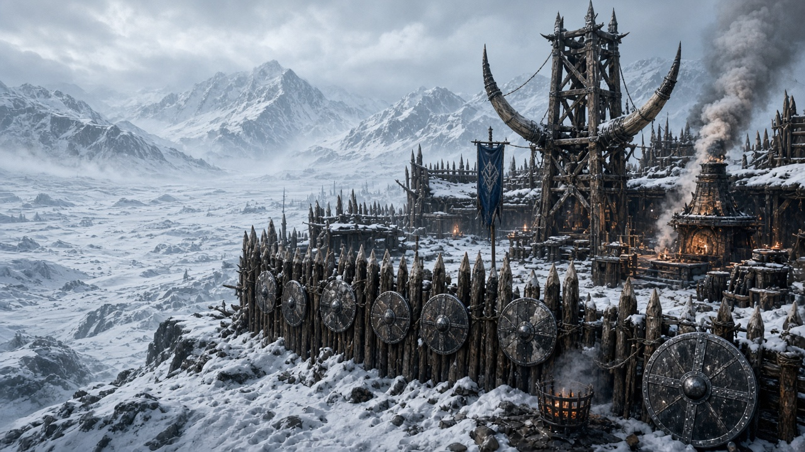
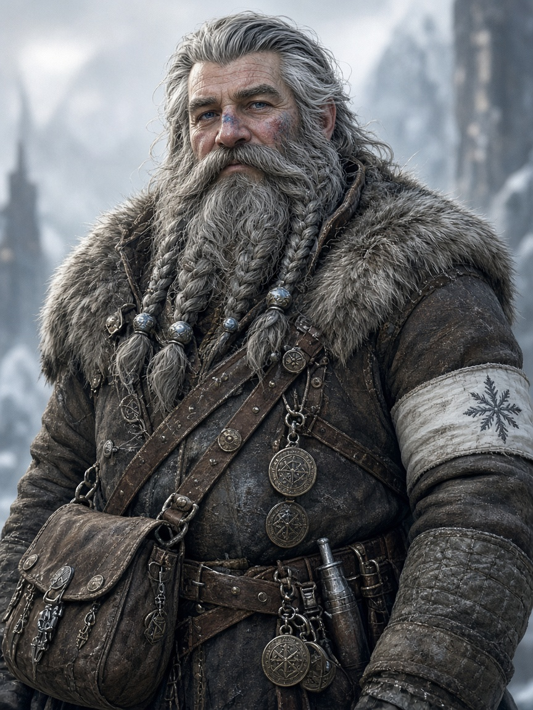
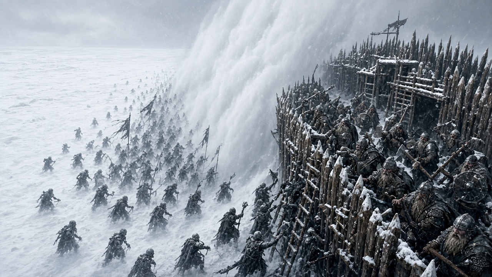
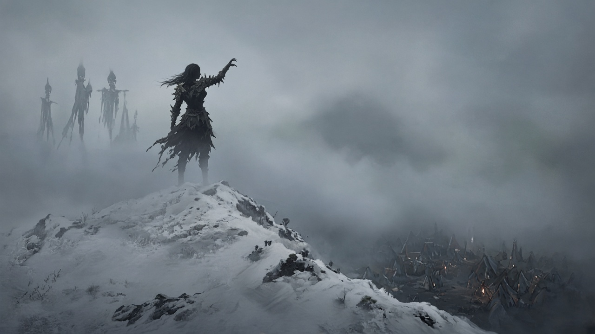
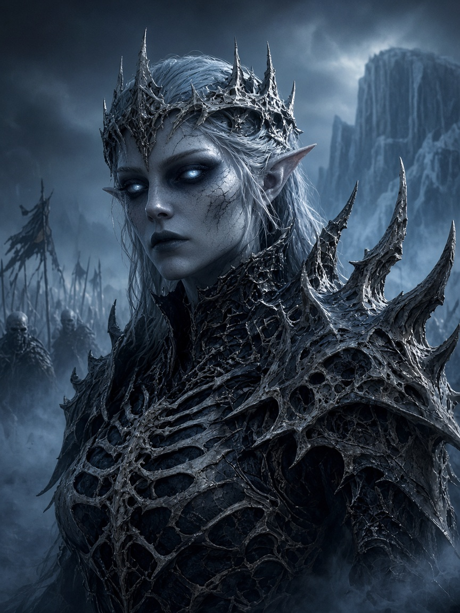

# 6 · Дверь E · Туманный Щит

**Открой, если выбрали льды / доспехи (Эларион тянет на север).**

# СЕССИЯ 2 — «Северная ниша» (дверь E · mq-06 · льды)

**Цель:** Эларион → зал порталов → **украденный северный камень** → Орден → портал → **Лагерь Туманного Щита** → **обязательная стычка** с нежитью → клифф (силуэт Лианэи).  
**Не цель:** бой с Лианэей; изъятие Доспехов; ветка меча/сапог; имя Кардиана.  
**Длина:** 3.5–4.5 ч.

## Биты

| # | Бит | Мин |
|---:|---|---|
| 2.0 | Эларион / сборы | 10–15 |
| 2.1 | Северная ниша пуста | 15–20 |
| 2.2 | Расследование камня | 60–90 |
| 2.3 | Шпионы / возврат | 20–35 |
| 2.4 | Ритуал → прыжок | 5–10 |
| 2.5 | Лагерь Туманного Щита | 25–40 |
| 2.6 | Стычка у линии тумана | 25–40 |
| 2.7 | Клифф + новость дома | 5–10 |

---

### 2.0 — Толчок Элариона

> **Кадр:** Северная ниша

> **Кадр:** Зал порталов

**Сказать:**

> Вы уже знаете: сестра Элариона — во льдах Ледяного Союза, «не живая и не мёртвая», в Доспехах, зовёт брата. Сегодня он не отпускает тему.

Эларион (или партия с ним) → **Кавил / зал порталов** — «северная линия», не Лес.  
Кавил может поддержать, но **не** главный заказчик вечера.

---

### 2.1 — Северная ниша

> **Кадр:** Маэрис

Те же хранители: **Маэрис**, **Брум**, **Селена**.

**Маэрис — Сказать:**

> Линия **Северная**. Не Порог. Не Лес. Ведёт к дварфам у тумана — **Туманный Щит**.  
> Камня нет. Без него я не открою. Как с Порогом: ищите.

| Проверка | DC | |
|---|---:|---|
| Perception | 12 | соседняя ниша Порога: если D не играли — камень на месте; если играли — уже стоит. Не путать. |

---

### 2.2–2.3 — Расследование северного камня

Тот же каркас, что у двери D, но **другой камень / другая ниша**.

| Путь | Проверки | Провал |
|---|---|---|
| След | Investigation **14** → Survival **13** → Stealth **14** | ложный след на юг |
| Люди | Persuasion/Intimidation **14**; Insight **15** | донос |
| Магия | Arcana **15** | путают с фиолетовой раной |
| Сила | бой ячейки | шум в верхнем городе |

**Бой ячейки:** 1× **Spy** + 2× **Thug** (dnd.su).  
**Допрос:** «на север нельзя» / «смерть ходит строем» — **без** карты вторжения на юг.  
Камень в свинцовом ларце; Arcana **12**.

---

### 2.4 — Ритуал → прыжок

Камень в **северную** нишу. 1 минута. Холод вместо серебра коры.

**Сказать:**

> Мир складывается. В лицо бьёт мороз и запах кузнечного дыма. Под ногами — мёрзлая земля и доски настила.

---

### 2.5 — Лагерь Туманного Щита

> **Кадр:** Туманный Щит

> **Кадр:** Хельда Щитолом

> **Кадр:** Брорр

Удивление дварфов («портал без гонца»). Комендант **Хельда Щитолом**; **Брорр** если с моста.

**Хельда / Брорр — Сказать:**

> Живые из Мостового портала. Либо герои, либо идиоты.  
> Туман жрёт дозоры. За линией — **строем**. Леди Льда.  
> *(если Эларион назван)* Брат? Тогда тебе дурацких советов не дам. Но лагерь — не твой трон.

Показать: частокол, рога, щиты к северу, серый туман на равнине.

---

### 2.6 — Стычка (обязательно)

> **Кадр:** Линия тумана · стычка

**Разведка тумана** лезет к частоколу / к дыре в дозоре.

| Волна | Кто | Статы | Заметки |
|---|---|---|---|
| Основная | 4× **Зомби** *или* 3× **Вурдалак** | [dnd.su](https://dnd.su/bestiary/) | под ур. 8–9 урезать HP |
| Жёстче (опц.) | +1× **Жрец** культа льда | только если рвутся вперёд | |

**Цель боя:** отбить прорыв, **не** гнаться на равнину.  
Если лезут в туман глубже 60 фт без плана — +2 зомби каждые 2 раунда; Хельда орёт вернуться.

После: раненый дозор — «она смотрела». Только Эларион (Wis **14**) чувствует **зов** в кости; остальные — холод.

---

### 2.7 — Клифф

> **Кадр:** Силуэт Лианэи

> **Кадр:** Лианэя · только силуэт

**Сказать:**

> За частоколом равнина белеет. В тумане — ряды. Далеко, на гребне, силуэт в доспехах, от которых несёт могилой. Голос — только брату: *«Иди ко мне.»*  
> Лагерь стоит. Портал за спиной ведёт домой. Разлом там не спит.

**Новость дома** (ровно 1):

| d4 | Новость |
|---:|---|
| 1 | Разлом: вылазка в низу, Дозор недосчитался |
| 2 | Орден жмёт Сильванор — слух о трещине стены |
| 3 | Хребет у моста требует «учёт» яиц |
| 4 | Милана молчит в кольце дольше обычного |

### XP

| | |
|---|---|
| Расследование / бой | камень + стычка |
| `xp_quest` с.2 | 2500–3500 |
| `xp_personal` | 500 Элариону; 250 за лагерь/Брорра |

## Чеклист

- [ ] Толчок = Эларион (видение / сестра)  
- [ ] Северная ниша ≠ Порог; камень **до** прыжка  
- [ ] Шпионы = Орден; нет Элдерин  
- [ ] Прыжок → **Туманный Щит**  
- [ ] Обязательная стычка  
- [ ] Нет изъятия Доспехов / боя с Лианэей  
- [ ] Нет Кардиана; только льды (не меню меча)  

---

[Оглавление](../README.md) · ← [5 · Дверь D](05-dver-d.md) · Далее → [7 · Дверь E·меч](07-dver-e-mech.md)
