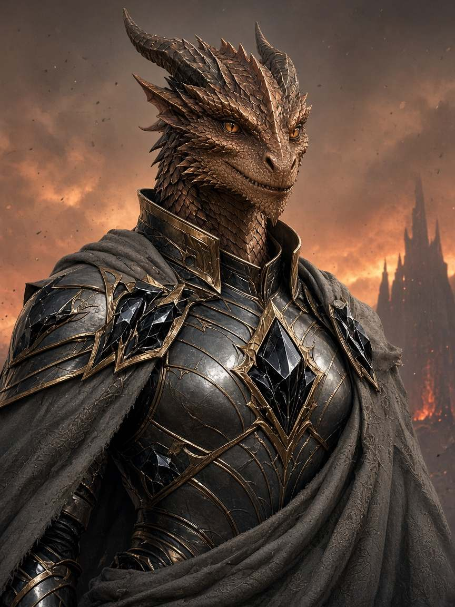
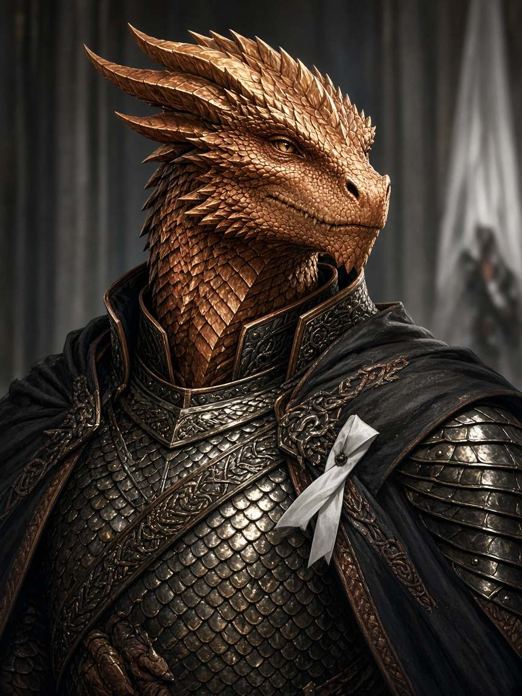
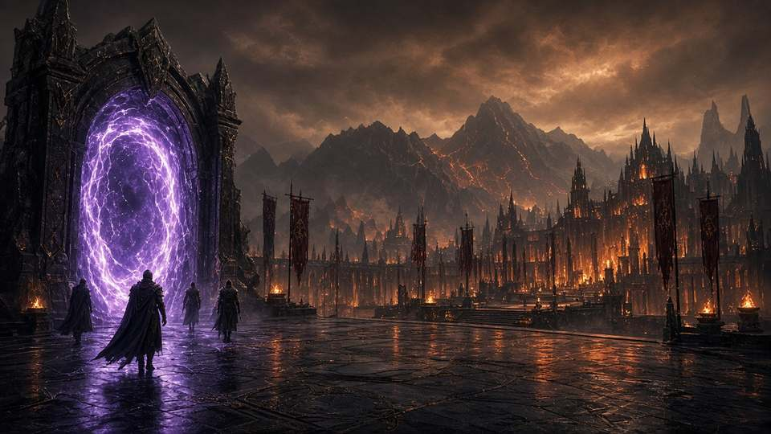
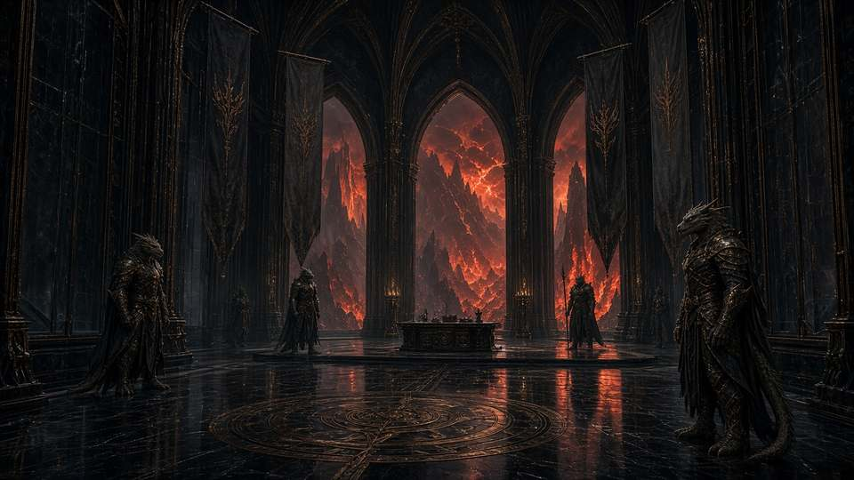
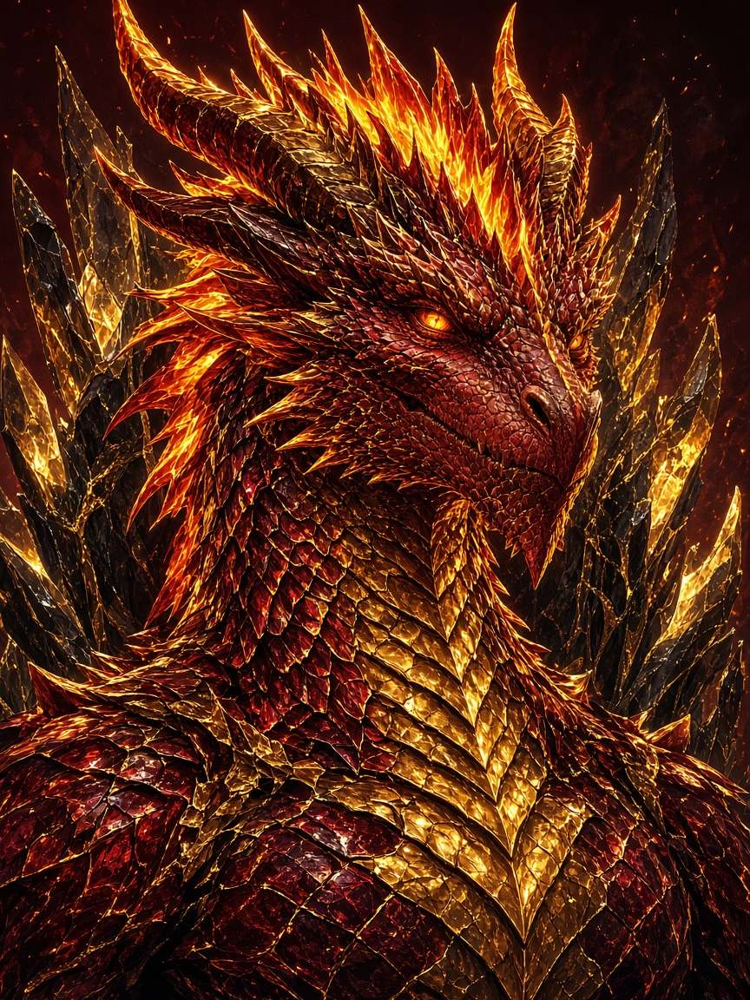
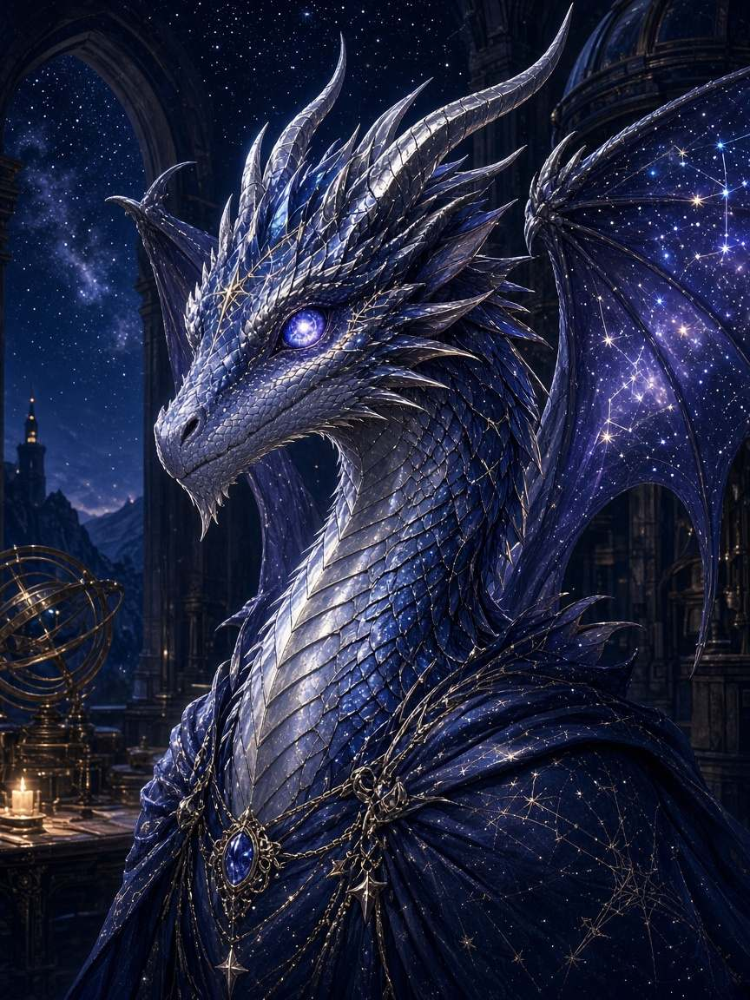
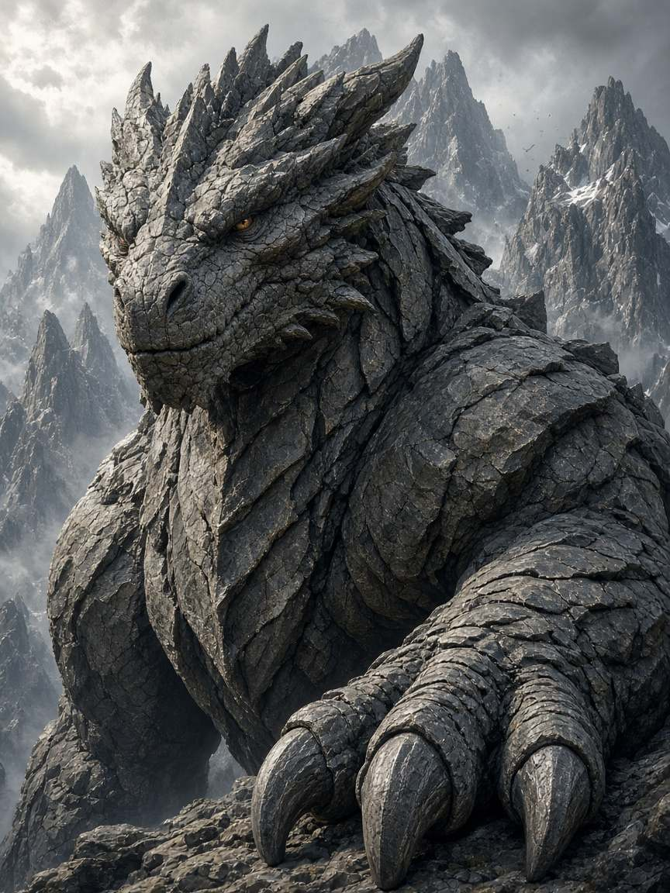
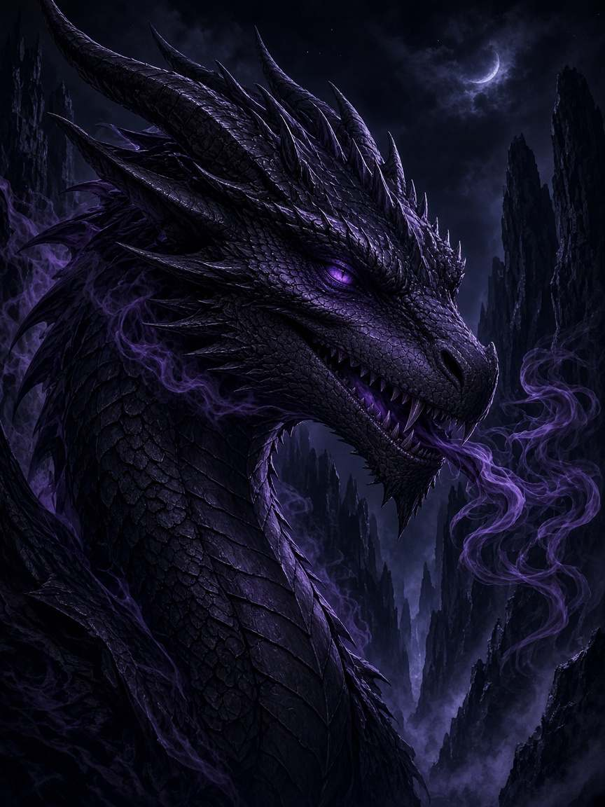
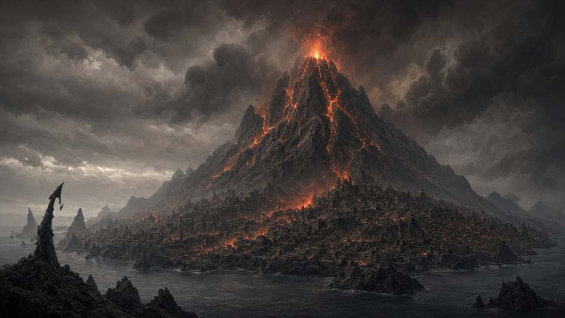

# 7 · Дверь E·меч · Город Пламени

**Открой, если выбрали меч / Хребет** (открытый мир; Элариона можно переубедить).

# СЕССИЯ 2 — «Дипломатический двор» (дверь E · mq-06 · меч)

**Цель:** союзный портал → **посольский двор** Города Пламени → добыть **сведения** о реликвии (не публично) → клифф (пик / Зариакс).  
**Не цель:** изъять Меч; бой с древними; яйца; Камнеград-месть весь вечер; Кардиан.  
**Длина:** 3.5–4.5 ч.

## Биты

| # | Бит | Мин |
|---:|---|---|
| 2.0 | Выбор / сборы | 10–15 |
| 2.1 | Портал союзников | 10–15 |
| 2.2 | Дипломатический двор | 25–40 |
| 2.3 | Расследование сведений | 60–90 |
| 2.4 | Давление / отказ | 20–35 |
| 2.5 | Клифф | 5–10 |

---

### 2.0 — Выбор меча

> **Кадр:** Саэрис Пепельный

> **Кадр:** Кезарр

Партия сама выбрала меч. Кавил/Тандил: портал к Хребту **есть** — союзный канал. Не обещают «отдадут меч».

**Сказать:**

> Союз с Хребтом — не дружба. Они ненавидят Звёздную Пыль сильнее, чем любят вас. Авангард получил приказ помочь Аэлендору. Это не приглашение к их святыням.

---

### 2.1 — Портал

> **Кадр:** Прибытие в жар

Не украденный камень (это льды/Лес). **Союзный** портал: зал Элиэлора / узел гарнизона.

**Сказать:**

> Мир складывается. В лицо бьёт сухой жар. Под ногами — плиты из тёмного стекла. Над двором — пепельное небо и силуэт хребта.

---

### 2.2 — Дипломатический двор

> **Кадр:** Дипломатический двор

> **Кадр:** Алазар · не на приёме гостей

> **Кадр:** Эридан · архивы/обсерватория как слух

> **Кадр:** Корвар

Встречают **вежливо и холодно**. Не трон Алазара — приёмная для чужих.

| Имя | Роль |
|---|---|
| **Саэрис Пепельный** | атташе двора; улыбка без тепла |
| **Кезарр Тал** | может «сопроводить» / бросить тень Камнеграда |

**Саэрис — Сказать:**

> Герои Стража. Союзники на бумаге. Здесь вы гости — не соискатели наших реликвий.  
> Спрашивайте о войне с Пылью. О гарнизоне. О пепле.  
> О том, что лежит на пиках — **не спрашивайте вслух**. Уши у стен чешуйчатые.

| Проверка | DC | |
|---|---:|---|
| Insight | 14 | он знает, *что* ищут; приказ — не подтверждать |

---

### 2.3 — Расследование (ядро)

Сведения о Мече **не** в открытом доступе.

| Путь | Как | Проверки | Провал |
|---|---|---|---|
| Дипломатия | союз / Пыль / «демоны заберут» | Persuasion **16–18** | отказ жёстче; −реп |
| Архивы | слух об Обсерватории Эридана; подкупить писца | Investigation **15**; Stealth/подкуп | донос Саэрису |
| Тень | намёк на **Зариакса** / Ночную Чешую | Insight **14**; контакты низа | ложный след |
| Сила | угрожать / лезть на пик | бой / Athletics | выдворение |

**Выдать 1–2 факта к клиффу:**

1. «Реликвия Падения» на **пике** над столицей — **Пепельный Гребень**.  
2. Триумвират **не делится**. Охрана пика ≠ городская стража.  
3. **Зариакс** может знать больше — за цену.  
4. Разлом Империи **не** у пика — искать меч «у Разлома» = ложный путь.

> **Кадр:** Зариакс · намёк, не встреча

> **Кадр:** Звёздная Пыль · общий враг (фон)

> **Кадр:** Пепельный Гребень

---

### 2.4 — Давление

**Саэрис — Сказать:**

> Хватит. Вы гости войны с Пылью — не охотники за нашим огнём.  
> Уйдите с тем, что заслужили: **слухом**. Или останьтесь — и мы решим, союзники вы или воры.

**Опц. стычка** (только если лезут силой):

| Кто | Статы |
|---|---|
| 2× драконорождённых стража | Veteran ([dnd.su](https://dnd.su/bestiary/veteran/)) |

Не обязательна.

---

### 2.5 — Клифф

> **Кадр:** Пепельный Гребень вдали

**Сказать:**

> У вас нет меча. Есть нитка: пик, запрет, имя, которое нельзя произносить громко во дворе.  
> За пеплом хребта кто-то смотрит — не Алазар. Возможно, тот, кто не сидит в триумвирате.  
> Портал за спиной ещё дышит жаром. Дома тикают другие часы.

**Новость дома** (1):

| d4 | |
|---:|---|
| 1 | Льды: мёртвые густеют |
| 2 | Орден у Сильванора |
| 3 | Пыль: флот шевелится |
| 4 | Разлом у моста: вылазка |

### XP

| | |
|---|---|
| Расследование | по проверкам |
| `xp_quest` с.2 | 2500–3500 |
| `xp_personal` | 500 за ключ о пике / Зариаксе |

## Чеклист

- [ ] Выбор меча = партия  
- [ ] Портал → **двор**, не пик  
- [ ] Сведения кодом, не «карта сокровищ»  
- [ ] Меч **не** изъят; яйца **не** тема  
- [ ] Нет Кардиана  
- [ ] Клифф = Пепельный Гребень / Зариакс  

---

[Оглавление](../README.md) · ← [6 · Дверь E льды](06-dver-e-ldy.md) · Далее → [8 · Галерея](08-galereya.md)
