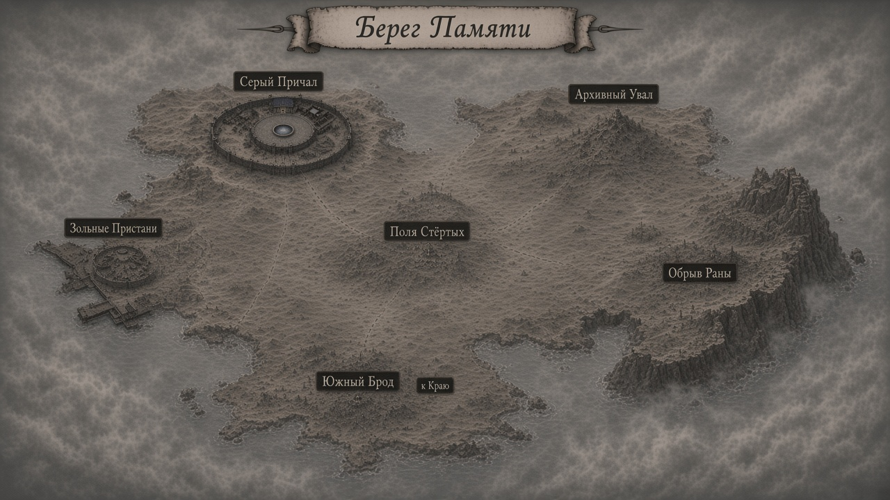

# Карта — Берег Памяти (**v1 на ревью**)

Копия: [`map.png`](map.png)

## Центры регионов (player)

| # | Подпись |
|---:|---|
| 1 | **Серый Причал** (город / вход с Лунного моста) |
| 2 | **Зольные Пристани** |
| 3 | **Южный Брод** (+ намёк «к Краю») |
| 4 | **Поля Стёртых** |
| 5 | **Обрыв Раны** |
| 6 | **Архивный Увал** |

Site города: [`../seryy-prichal/map.md`](../seryy-prichal/map.md)  
Атлас плана: [`../dead-plane-map.md`](../dead-plane-map.md)

Имена регионов — **prep** до ok мастера на эту карту.
