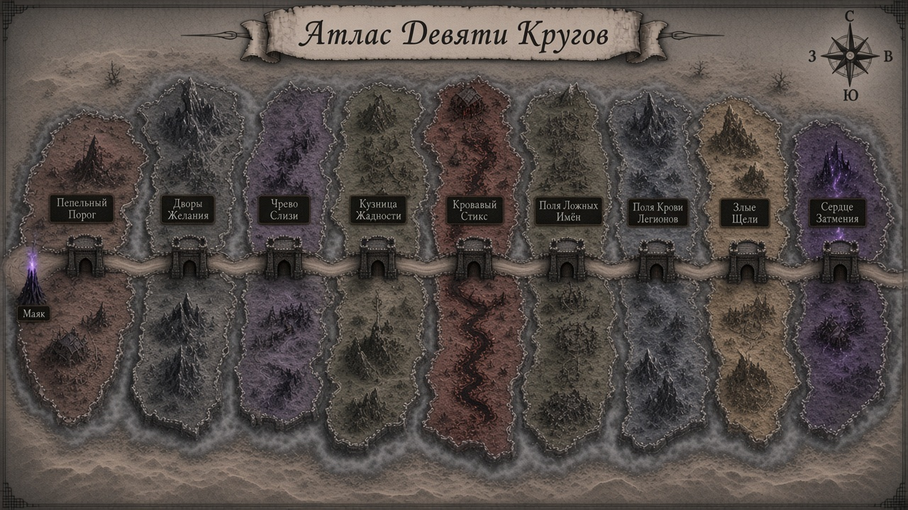

# Атлас Девяти Кругов

**Статус:** draft **v3** — ждём ok.  
Компоновка: **вытянутый** атлас государств (не концентрические кольца). Слева вход → справа дно. Между соседями — **ворота**.

Бриф: [`demon-plane-map-brief.md`](demon-plane-map-brief.md)  
Файлы: `assets/maps/demon-plane/demon-plane-atlas-v3.png` (current)

## Государства (слева → направо)

| # | Имя |
|---:|---|
| 1 | Пепельный Порог (+ **Маяк**) |
| 2 | Дворы Желания |
| 3 | Чрево Слизи |
| 4 | Кузница Жадности |
| 5 | Кровавый Стикс |
| 6 | Поля Ложных Имён |
| 7 | Поля Крови Легионов |
| 8 | Злые Щели |
| 9 | Сердце Затмения |

v1–v2 (кольца) — отброшены.
