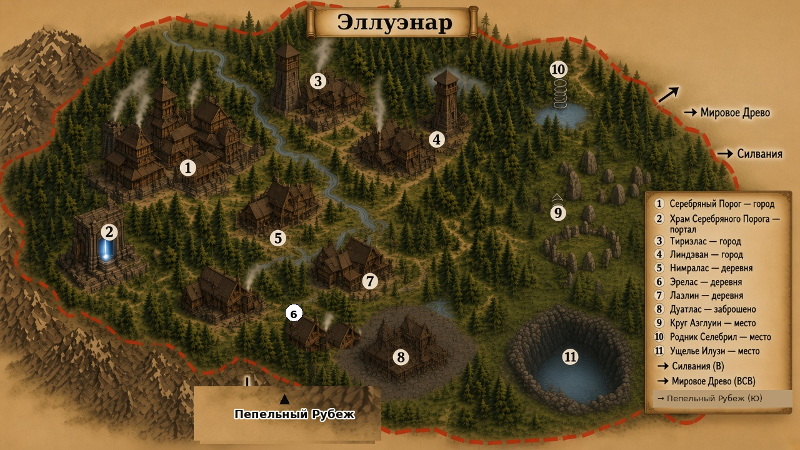

# Карта — Эллуэнар (v7)

Asset: [`../../../../assets/maps/elluenar/elluenar-region-map-v7.png`](../../../../assets/maps/elluenar/elluenar-region-map-v7.png)

Регион Леса Хранителей вокруг **Серебряного Порога**.  
Силванию / Древо / Рубеж **не** рисуем внутри — только стрелки по карте страны.

## Легенда

| # | Подпись | Тип | На листе |
|---:|---|---|---|
| 1 | **Серебряный Порог** | город · центр | З / СЗ у гор |
| 2 | **Храм Серебряного Порога** | портал | **вне** города, рядом (Ю/ЮЗ от #1); единственная арка |
| 3 | **Тириэлас** | мелкий город | С / СВ |
| 4 | **Линдэван** | мелкий город | В от хаба, у реки |
| 5 | **Нимралас** | деревня | центр |
| 6 | **Эрелас** | деревня | южный полог |
| 7 | **Лаэлин** | деревня | юг / центр |
| 8 | **Дуатлас** | заброшено | юг, серый карман |
| 9 | **Круг Аэглуин** | место | восток |
| 10 | **Родник Селебрил** | место | СВ |
| 11 | **Ущелье Илуэн** | место | ЮВ |

## Указатели (карта страны)

| Стрелка | Азимут с Эллуэнара | Почему |
|---|---|---|
| **→ Силвания** | **восток (В)** | столица восточнее Порога, внутрь полога |
| **→ Мировое Древо** | **ВСВ / СВ** | севернее-центральнее страны; не путать со столицей |
| **→ Пепельный Рубеж** | **юг (Ю)** | на карте страны Рубеж южнее Порога у гор *(монастырь — только знание мастера, не на карте)* |

Лок: [`canon-lock-2026-09-27-elluenar-map-directions.md`](../../plot/canon-lock-2026-09-27-elluenar-map-directions.md)

## Заметки

- Порчу на карту не наносям.  
- Монастырь высокородных = в **Пепельном Рубеже** (мастер; на карте региона не писать).  
- Site храма: [`../serebryanyy-porog/`](../serebryanyy-porog/).
