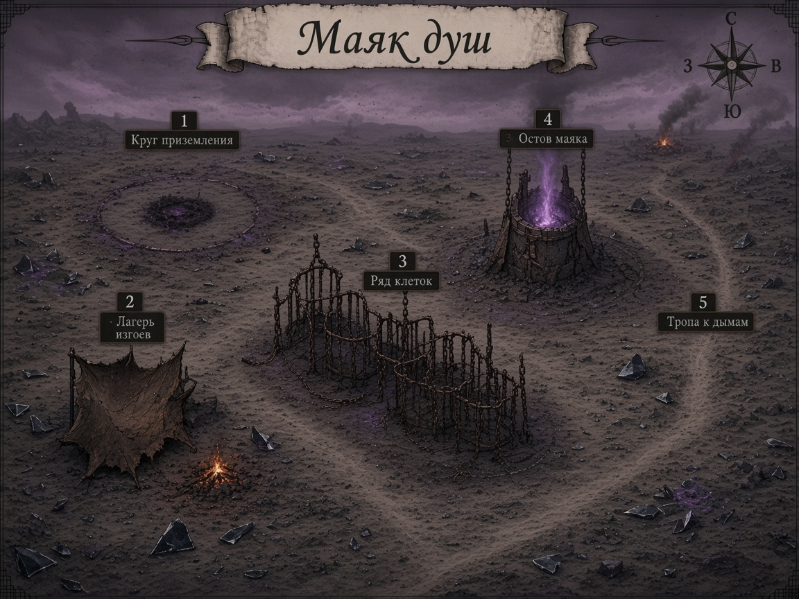

# Карта Маяка душ

**Статус:** draft v1 — ждём ok мастера (как Причал до лока).  
Файлы: [`map.png`](map.png) · [`../../../../assets/maps/mayak-dush/mayak-dush-map.png`](../../../../assets/maps/mayak-dush/mayak-dush-map.png) · draft [`…-v1.png`](../../../../assets/maps/mayak-dush/mayak-dush-map-v1.png)

Скрипт с.2 A: [`../../arcs/arc-3/quests/mq-01-sessions-1-2-detail.md`](../../arcs/arc-3/quests/mq-01-sessions-1-2-detail.md) §2.6  
Playbook: [`playbook.md`](playbook.md)

## Номера на карте

| # | Место | Заметка |
|---:|---|---|
| 1 | Круг приземления | выход фиолетового потока |
| 2 | Лагерь изгоев | **канон:** остов большой клетки; на v1 визуально — укрытие у костра (итерация ok) |
| 3 | Ряд клеток | поле боя / side |
| 4 | Остов маяка | фиолетовый столб; клифф |
| 5 | Тропа к дымам | край сида → Алтарный тракт (фон) |

Ориентиры: **С** ≈ круг / маяк на горизонте · **В** ≈ дымы · **З** ≈ лагерь.

## Не на карте (намеренно)

Сборщик Огарков · имена изгоев · Алтарь / Филактерий / Око.
