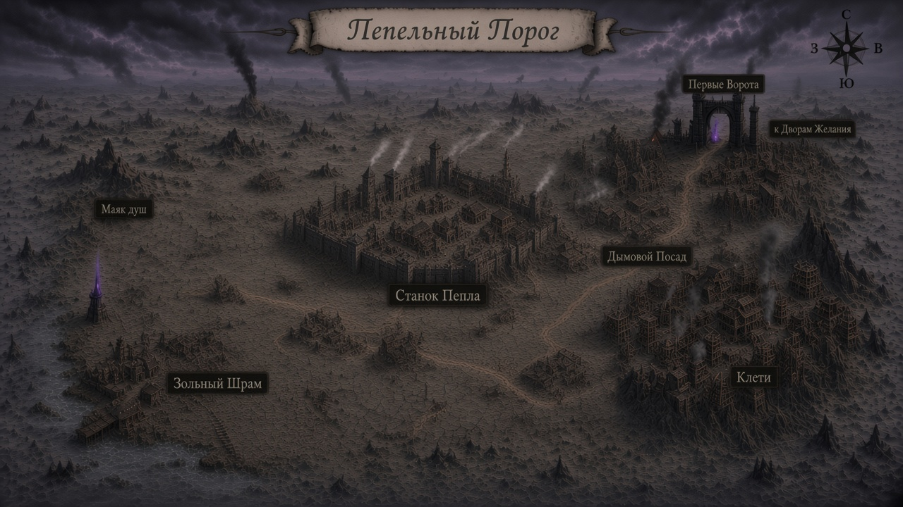

# Карта — Пепельный Порог (**v5 · города · review**)

Копия: [`map.png`](map.png)  
**За стол:** [`../../arc3-visual-book/chapters/12-karty.md`](../../arc3-visual-book/chapters/12-karty.md)

## Центры (prep-имена до опроса)

| # | Подпись | Тип |
|---:|---|---|
| 1 | **Маяк душ** | место |
| 2 | **Зольный Шрам** | город |
| 3 | **Станок Пепла** | город · столица |
| 4 | **Клети** | город |
| 5 | **Дымовой Посад** | город |
| 6 | **Первые Ворота** | город-ворота |

Site Маяка: [`../mayak-dush/map.md`](../mayak-dush/map.md)
