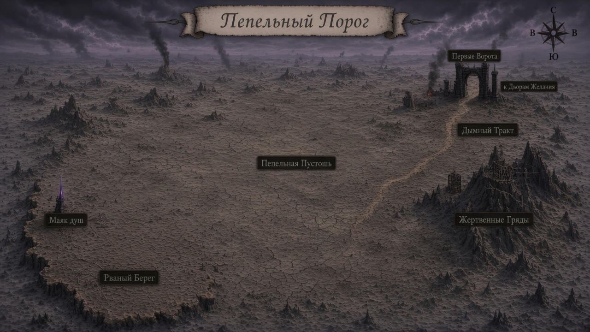

# Карта — Пепельный Порог (**v3 на ревью**)

Копия: [`map.png`](map.png)  
**За стол:** [`../../arc3-visual-book/chapters/12-karty.md`](../../arc3-visual-book/chapters/12-karty.md)

## Центры регионов (бриф сверки)

| # | Подпись |
|---:|---|
| 1 | **Маяк душ** |
| 2 | **Рваный Берег** |
| 3 | **Пепельная Пустошь** |
| 4 | **Жертвенные Гряды** |
| 5 | **Дымный Тракт** |
| 6 | **Первые Ворота** |

Кириллица заголовка: **Пепельный Порог**.  
Site Маяка (не путать регионы): [`../mayak-dush/map.md`](../mayak-dush/map.md)
