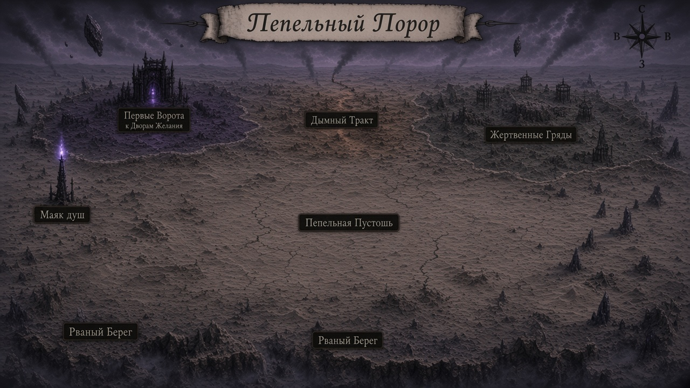

# Карта — Пепельный Порог (**v1 на ревью**)

Копия: [`map.png`](map.png)

## Центры регионов (player)

| # | Подпись |
|---:|---|
| 1 | **Маяк душ** (мелкий объект; вход с Лунного моста) |
| 2 | **Рваный Берег** |
| 3 | **Пепельная Пустошь** |
| 4 | **Жертвенные Гряды** |
| 5 | **Дымный Тракт** |
| 6 | **Первые Ворота** (к Дворам Желания) |

Site Маяка: [`../mayak-dush/map.md`](../mayak-dush/map.md)  
Атлас плана: [`../demon-plane-map.md`](../demon-plane-map.md)

Имена регионов — **prep** до ok мастера на эту карту.
