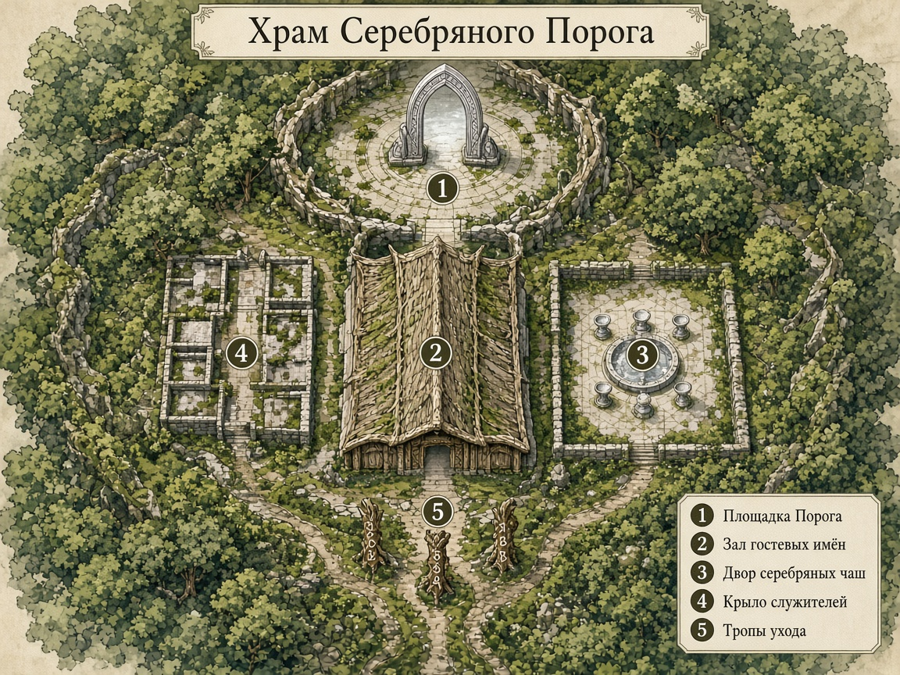

# Карта — Храм Серебряного Порога

Также: [`../../../../assets/maps/serebryanyy-porog/serebryanyy-porog-map.png`](../../../../assets/maps/serebryanyy-porog/serebryanyy-porog-map.png)

## Номера

| # | Зона |
|---:|---|
| **1** | Площадка Порога (портал) |
| **2** | Зал гостевых имён |
| **3** | Двор серебряных чаш |
| **4** | Крыло служителей |
| **5** | Тропы ухода (Силвания / Малфурион / глушь) |

Ориентир: **север** = портал · **юг** = тропы в Лес.
