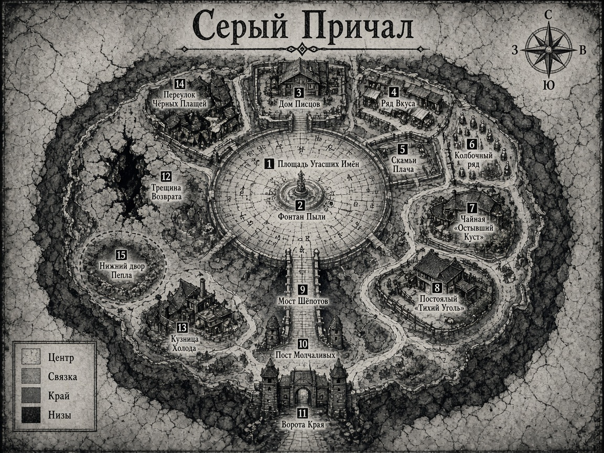

# Карта Серого Причала

**Версия для игроков** — без пометок про план/квест.

Файлы:
- [`map.png`](map.png)
- архив: [`../../../../assets/maps/seryy-prichal/seryy-prichal-map.png`](../../../../assets/maps/seryy-prichal/seryy-prichal-map.png)

## Легенда номеров (= playbook)

| # | Место | Зона |
|---:|---|---|
| 1 | Площадь Угасших Имён | Центр |
| 2 | Фонтан Пыли | Центр |
| 3 | Дом Писцов | Центр (север) |
| 4 | Ряд Вкуса | Центр (восток) |
| 5 | Скамьи Плача | Центр (восток) |
| 6 | Колбочный ряд | Центр (восток) |
| 7 | Чайная «Остывший Куст» | Центр |
| 8 | Постоялый «Тихий Уголь» | Центр |
| 9 | Мост Шёпотов | Связка (юг) |
| 10 | Пост Молчаливых | Связка |
| 11 | Ворота Края | Край (юг) |
| 12 | Трещина Возврата | вход / запад площади |
| 13 | Кузница Холода | Край |
| 14 | Переулок Чёрных плащей | Низы (запад) |
| 15 | Нижний двор Пепла | Низы (под площадью) |

Ориентиры: **север** = Писцы · **юг** = Край · **запад** = Трещина/Плащи · **восток** = вкус/плач/колбы.
