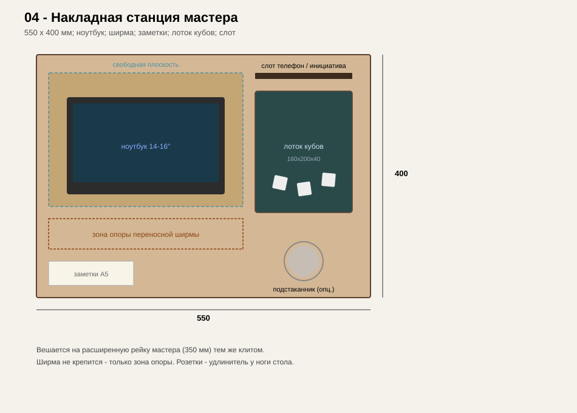
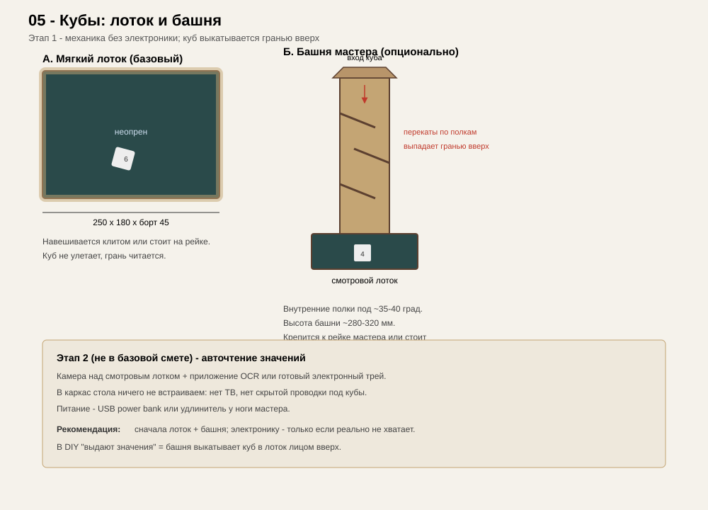

# 02. Чертежи и размеры

Все размеры в миллиметрах. Допуск на распил фанеры: ±0,5 мм. Зазор топпера по периметру ниши: 2 мм суммарно.

Интерактивный просмотр: [viewer.html](viewer.html).

## Сводная таблица габаритов

| Элемент | Длина | Ширина | Высота / толщина |
|---------|-------|--------|------------------|
| Стол общий | 2200 | 1100 | 750 (до верха рейки) |
| Ниша (свет) | 1800 | 700 | 90 (глубина) |
| Рейка длинных сторон | 2200 | 200 | 40 (пакет) |
| Рейка короткой «игроки» | 700 внутр. + стыки | 200 | 40 |
| Рейка мастера | — | 350 | 40 |
| Ledge под топпер | по периметру ниши | 12×12 | −18 от верха |
| Дно ниши | 1796 | 696 | 12 + сукно 3–4 |
| Топпер (3 панели) | ~598 каждая | ~736 | 18 |
| Мини-столик игрока | 380 | 300 | 18 + клит |
| Станция мастера | 550 | 400 | 18 + клит |
| Лоток кубов | 250 | 180 | 45 (борт) |
| Ножки | — | 70×70 или Ø60 | ~710 |

Высота сиденья: стандартный стул 450 мм → комфортный зазор до низа стола ≥ 650 мм свободного пространства для колен (учитывать царги).

## SVG-чертежи

### 01 — План сверху

Каркас, ниша, расширенная зона мастера, схема размещения накладок на 8 игроков.

### 02 — Разрез А–А

Рейка, ledge, дно, сукно, топпер заподлицо, клит накладки.

### 03 — Мини-столик игрока

Плоскость A4, слот гаджета, карман, подстаканник, клит.

### 04 — Станция мастера

Ноутбук, слот, лоток кубов, место под ширму.

### 05 — Лоток и башня кубов

Мягкий лоток + опциональная dice tower.

### 06 — Топпер

Три панели, шканты, зазоры.

### 07 — Узел крепления (клит)

Профиль рейки и крюка накладки.

### 08 — Взорванная сборка

Порядок слоёв: ножки → царги → дно → стенки ниши → рейка → ledge → сукно → топпер / накладки.

## Раскрой фанеры (ориентир под распил Леман ПРО)

Листы **1525×1525×18** (ФК/ФСФ шлиф. 2/3 или лучше) и **1525×1525×12**.

Примерный список деталей 18 мм:

| Код | Деталь | Шт. | Размер |
|-----|--------|-----|--------|
| R1 | Рейка длинная | 2 | 2200 × 200 |
| R2 | Рейка мастер | 1 | 1100 × 350 |
| R3 | Рейка дальняя | 1 | 1100 × 200 |
| V1–V4 | Стенки ниши | 4 | см. разрез (высота 90) |
| T1–T3 | Топпер | 3 | 598 × 736 |
| P1–P8 | Столик игрока | 8 | 380 × 300 |
| D1 | Станция мастера | 1 | 550 × 400 |
| C1–C8 | Клиты игроков | 8 | 300 × 50 × пакет |
| C9 | Клит мастера | 1 | 400 × 50 |
| DT1–DT2 | Лоток кубов дно | 2 | 250 × 180 |
| — | Бортики лотков / башня | набор | см. чертёж 05 |

12 мм:

| Код | Деталь | Шт. | Размер |
|-----|--------|-----|--------|
| F1 | Дно ниши | 1 | 1796 × 696 |

> **Важно:** длинные рейки 2200 мм длиннее листа 1525 — либо стык по длине на шкантах/ламелях с усилением снизу, либо брать лист **2440×1220** (ФСФ) там, где есть в Леман ПРО / на лесобазе. В спецификации заложен вариант со стыком и вариант с листом 2440.

## Масштаб и печать

SVG в миллиметрах viewBox. Для печати A3: в браузере → печать → «вписать в страницу» или открыть в Inkscape и задать масштаб 1:10 / 1:5.
